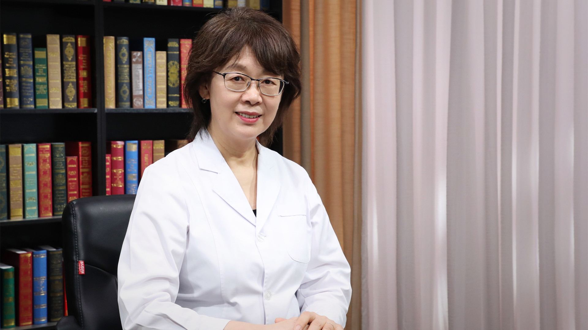

# 儿童过敏性鼻炎

---

## 赵京 主任医师

首都儿科研究所附属儿童医院变态反应科主任医师 教授 博士生导师；

中华医学会变态反应学分会副主任委员；中国医师协会变态反应医师分会副会长；北京医学会儿科学分会呼吸学组组长 儿科哮喘协作组组长；北京医师协会变态反应专科医师分会副会长；北京医学会过敏变态反应学分会常务委员。

**主要成就：** 主持完成中国国家科技支撑项目、北京市自然科学基金和首都发展基金等多项课题研究；两次获北京市科技进步奖；国内外发表论文60余篇。

**专业特长：** 主要从事儿科呼吸系统疾病、儿童哮喘及其他过敏性疾病的临床及科研工作。
