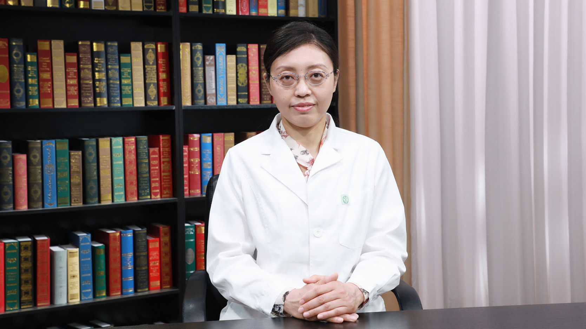

# 2.28 儿童咳嗽变异性哮喘

---

## 沙莉 主任医师

首都儿科研究所附属儿童医院变态反应科主任医师 医学博士 硕士生导师；

中华医学会儿科学分会呼吸学组哮喘协作组副组长；中华医学会变态反应学分会青年委员暨儿童哮喘过敏学组委员；中国预防医学会过敏病预防与控制专业委员会预防食品药物过敏学组成员；中国研究型医院学会过敏医学专业委员会儿童过敏学组副组长；中国医师协会变态反应医师分会青年委员；中国中西医结合学会儿科专业委员会青年委员会副主任委员；北京市儿科哮喘协作组秘书。

**主要成就：** 曾主持儿童牛奶蛋白过敏、胸闷变异性哮喘的课题，并作为主要研究人员参与多项哮喘过敏的研究项目；在国内外核心期刊发表论著近20篇；参编《儿童支气管哮喘的诊断与治疗（第三版）》《儿童哮喘百问》《基层医师门诊哮喘与过敏性疾病诊疗手册》等书。

**专业特长：** 擅长儿童过敏性疾病，包括儿童哮喘、咳嗽变异性哮喘、慢性咳嗽、过敏性鼻炎、食物过敏、荨麻疹、特异性免疫治疗等

---

## 咳嗽变异性哮喘是怎么回事？有什么症状？

（采访）咳嗽变异性哮喘是怎么回事？

咳嗽变异性哮喘是一种特殊类型的哮喘，它也是慢性咳嗽中最常见的一种疾病。我先介绍一下慢性咳嗽是怎么回事。慢性咳嗽就是以咳嗽为唯一或主要的临床表现，但是胸部X片是正常的，它的病程往往持续在儿童是4周以上，在成人可能是要8周以上，这就是一个慢性咳嗽。

慢性咳嗽分广义的慢咳，只要有咳嗽的特点，超过4周就可以诊断了。它还有狭隘意义上的咳嗽，就是很难通过常规的手段找到病因，咳嗽变异性哮喘也叫CVA，它就属于狭义的慢咳的病因之一。

咳嗽变异性哮喘的临床特点就肯定是以咳嗽为唯一或主要的临床症状。除此之外，它的咳嗽还有自己的特点，小朋友往往是在活动之后，或者是情绪激动的时候，或者是夜间，还有凌晨四五点钟的时候，这种情况下咳嗽会明显一些。

再有它的咳嗽往往是干咳为主，大概70%的CVA，它表现出来的是一个干性的咳嗽，所谓的干咳就是听着没有明显的痰音。还有一个特点就是这个类型的咳嗽，抗生素治疗往往效果不是特别理想。

（采访）主任，儿童咳嗽变异性哮喘，大部分人的症状可能都是干咳，会不会也有有痰的咳嗽这样的情况？

对，是这样的，我刚才前面说过70%是干咳为主，但是当小朋友合并了感染，或者他的咳嗽是多病因引起的。虽然CVA是我们最常见的一个慢咳的原因，但是也有一些CVA的小朋友，他可以合并上气道咳嗽综合征，或者是合并感染后咳嗽，或者是这三种疾病都出现在同一个孩子身上，他既有上气道的问题，又有CVA、又有感染的问题，尤其是他合并感染问题的时候，他的咳嗽可以出现湿咳，就是有痰的这种咳嗽。

这种情况在治疗上也不是绝对说抗生素无效，合并感染的这种，他使用抗生素治疗之后，他的咳嗽会有明显缓解，但是他老是觉得好不利落，去不了根的那种感觉。

（采访）主任，儿童变异性哮喘是在凌晨或者在运动之后，出现比较明显的咳嗽，是不是咳嗽的发病是有诱因的？

对，他咳嗽是有诱因的。其实根本的原因就是他气道出现了一种慢性非特异性炎症，这种炎症就导致他的气道出现高反应性。什么是高反应性？就是他气道变得特别敏感，比如有的人活动或者吃甜的、凉的，或者吸冷空气，正常人可能没什么反应，但是这种气道敏感的孩子，就会诱发这种咳嗽的出现。

（采访）主任，儿童咳嗽变异性哮喘的发病率高吗？

在慢性咳嗽中，它是最常见的一个原因，大概在2010年的时候，全国做了一个19个省市的儿童慢性咳嗽的调查研究，相当于是一个慢咳的流调。调查研究发现慢性咳嗽里面接近50%的孩子是存在咳嗽变异性哮喘的，所以它在慢咳里面非常常见。

---

## 儿童咳嗽变异性哮喘和支气管哮喘有什么区别？

（采访）主任，儿童的咳嗽变异性哮喘，它和支气管哮喘有什么区别呢？

咳嗽变异性哮喘是一种特殊类型的哮喘，它也是慢性咳嗽中最常见的一种疾病。它跟典型哮喘最大的区别就是，它只有咳嗽。典型的哮喘可能最显著的一个特征就是孩子会出现喘息。

我们临床上会询问家长，这个孩子初期的时候有没有那种丝儿丝儿，吹哨或拉弦儿的声音。咳嗽变异性哮喘跟典型哮喘在临床上最大的区别，就是它没有喘息，丝儿丝儿或者是拉弦儿的这种声音。

（采访）咳嗽变异性哮喘最主要的还是咳嗽。

对，咳嗽为主。

（采访）主任，儿童咳嗽变异性哮喘，它会不会发展为支气管哮喘？

会的。如果没有得到及时的诊断、治疗，或者是治疗不当的话，有一部分孩子，比例大概是1/3-1/2的孩子，他可能就会从CVA（咳嗽变异性哮喘）进展为典型的哮喘。

（采访）主任，这样会有什么样的危害？

不管是CVA，还是典型的哮喘，其实对孩子都有一定的影响。因为这种病往往是慢性的，而且会反复发作的一个过程。在这个过程中，孩子出现咳嗽或者是喘息，势必会影响他的一些正常生活，包括睡眠，还有小朋友可能不能正常去上课，还有影响他的体育活动。如果出现了急性发作，可能会危及生命，严重哮喘的急性发作。

---

## 儿童咳嗽变异性哮喘是什么原因引起的？

（采访）主任，儿童咳嗽变异性哮喘，它是由什么原因导致的？

咳嗽变异性哮喘和典型的哮喘一样，或者说所有疾病的发生其实都是两方面，一个就是内因，一个就是外因。外因就是周围环境的因素，内因就是机体自身的因素，我们叫遗传的易感性。

尤其是一些过敏体质的孩子，他可能比较容易发生过敏性的疾病。尤其是父母，或者是爷爷奶奶、姥姥姥爷这种一级、二级的亲属里，如果有过敏性疾病的家族史，这个孩子就有遗传的易感性。他就容易出现除了哮喘、鼻炎之外，还可能会出现像湿疹、食物过敏这一类的过敏性疾病。

第二个就是环境的因素。我虽然有遗传易感性，但我也需要外界的环境刺激，我才会出现这种疾病的发生。环境因素最重要的就是变应原，我们也叫过敏原。反复地接触，暴露在过敏原的过程中，我可能就会出现这种疾病的发生。是两方面的原因综合起来作用的结果。

（采访）主任，现在有过敏性鼻炎的孩子也是比较多的，有过敏性鼻炎会不会后期有咳嗽变异性哮喘？

是这样的，包括国际上的ARIA指南一直在推崇的一个理念，就是“同一气道，同一疾病”，就是说上气道和下气道是共同的，上气道疾病会影响下气道，下气道疾病往往也合并着上气道的问题。过敏性鼻炎如果不及时控制或者是治疗不当，气道的炎症就会向下发展，就会出现包括咳嗽变异性哮喘在内的其他的一些问题。

当然了我们还有胸闷变异性，就是以胸闷为主要表现的。还有就是典型的哮喘。另一方面就是哮喘的孩子，也有很多情况下会合并着上气道的疾病，百分之七八十会合并有鼻炎、鼻窦炎的上气道问题。

---

## 儿童咳嗽变异性哮喘和遗传有关吗？

（采访）儿童咳嗽变异性哮喘，它是不是遗传的？会不会遗传？

遗传是非常重要的一个原因。说到遗传，父母双方如果都没有这种过敏性疾病，这个孩子并不是完全没有得哮喘或者是过敏性疾病的风险，他其实是有25%的几率会出现这种包括哮喘在内的过敏性疾病。

如果父母双方一方有过敏的话，这个孩子患病的几率就会有50%。如果父母双方都有过敏性疾病，这个孩子得过敏性疾病的几率就会升高到75%。所以遗传在这个疾病的发生发展中，占了非常重要的一个方面。

---

## 诊断儿童咳嗽变异性哮喘需要做什么检查？

（采访）主任，对于儿童咳嗽变异性哮喘，我们要怎么样来诊断？需要做什么检查？

咳嗽变异性哮喘的临床特点肯定是以咳嗽为唯一或主要的临床症状。除此之外，它的咳嗽还有自己的特点，小朋友往往是在活动之后，或者是情绪激动的时候，或者是夜间，还有凌晨四五点钟的时候，这种情况下咳嗽会明显一些。

再有咳嗽变异性哮喘的咳嗽往往是干咳为主，大概70%的CVA（咳嗽变异性哮喘），它表现出来的是一个干性的咳嗽，所谓的干咳就是听着没有明显的痰音。还有一个特点就是这个类型的咳嗽，抗生素治疗往往效果不是特别理想。

除了刚才我说的这种典型的临床症状，包括他用药治疗，抗生素无效这些特点之外，我们可能还要做一些相应的辅助检查。包括肺功能的检查，还有过敏原的检查。

但是咳嗽变异性哮喘通气功能往往都是正常的，这种情况下可能还需要我们进一步去做一些其他的气道反应性的检查，包括给他做一个支气管舒张试验。像大孩子有条件，我们还会做一个支气管的激发试验，来协助我们明确诊断。

此外就是过敏原的检查，如果这个孩子年龄特别小，我们没有条件去给他测肺功能，我们可以通过查皮肤，还有查血清，来明确他到底有没有过敏原的存在。

如果这两种都没有条件去检查的话，我们也可以给他试验性治疗，临床上我们高度怀疑他是咳嗽变异性哮喘，我们可以给他一些相应的药物治疗一段时间，看看他的疗效，来判断他是不是这个疾病的可能。

另外，胸部X片也是很重要的，因为对于慢性咳嗽的孩子，我们需要进行一些鉴别诊断，尤其是年龄小的一些孩子，我在临床上也见过，有一些被当做咳嗽变异性哮喘治疗，效果并不是很好的孩子。

我记得在门诊看过一个3-5岁的孩子，他是当慢咳治疗效果不太好。但是当你去追问他的病史，你发现他曾经有吃东西呛到过的这种病史，当时给那个孩子照的片子，里面就有一个异物。所以胸部X片在我们鉴别诊断的时候，还是值得我们去注意，去问病史，还要注意去做相应的检查。

CVA（咳嗽变异性哮喘）诊断里有一个特别重要，虽然前面这些都很重要，但是我觉得有一个特别重要的就是排除其他原因引起的慢性咳嗽。我们不要只想着这个病是最常见的，就忘了去排除其他的一些原因。

---

## 儿童咳嗽变异性哮喘需要和哪些疾病鉴别？

（采访）儿童咳嗽变异性哮喘需要和哪些疾病去鉴别？

咳嗽变异性哮喘是一种特殊类型的哮喘，它也是慢性咳嗽中最常见的一种疾病。咳嗽变异性哮喘的临床特点肯定是以咳嗽为唯一或主要的临床症状。除此之外，它的咳嗽还有自己的特点，小朋友往往是在活动之后，或者是情绪激动的时候，或者是夜间，还有凌晨四五点钟的时候，这种情况下咳嗽会明显一些。

再有它的咳嗽往往是干咳为主，大概70%的CVA（咳嗽变异性哮喘），它表现出来的是一个干性的咳嗽，所谓的干咳就是听着没有明显的痰音。还有一个特点就是这个类型的咳嗽，抗生素治疗往往效果不是特别理想。

我们需要鉴别一些常见的引起慢性咳嗽的，主要就是其他的几类。因为慢咳在儿童最常见的4个就是感染后咳嗽，还有上气道咳嗽综合征，还有咳嗽变异性哮喘，还有一个就是胃食管反流。其他几种疾病相对来说，尤其是上气道咳嗽综合征也是非常常见的。

上气道咳嗽综合征，顾名思义就是上气道的疾病引起的。就是鼻炎、鼻窦炎、腺样体肥大，这些疾病其实也会引起慢性咳嗽的出现，在临床上表现也是咳嗽为主，病程时间比较长。但是上气道咳嗽综合征除了咳嗽之外，往往会有鼻部的一些症状。小朋友典型的会有打喷嚏、流鼻涕、鼻塞，还有鼻痒这些表现。

对于年龄小的孩子，他可能症状表现不会特别明显，他不会说他鼻痒，但是家长会注意到他经常有揉鼻子、抠鼻子这样的动作。还有就是鼻塞，他可能不会说鼻子堵，但是去观察的时候，我们会问家长，他有没有经常张口呼吸，尤其是他睡觉的时候，喜欢张着嘴喘气儿，这种情况就可能代表他鼻子有阻塞的情况。

还有如果是腺样体肥大的话，这些孩子可能会有打呼噜、打鼾的这种情况。还有一个咳嗽特点，它跟体位是相关的，CVA50%会出现夜间咳嗽，但不是所有的夜间咳嗽都一定是CVA。

比如说上气道咳嗽综合征，有的家长会说，他只有躺着睡觉的时候咳嗽，他站着待着的时候，或者他坐起来的时候就咳嗽不明显，这种情况就要注意鼻涕倒流刺激引起咳嗽的这种可能。这个咳嗽是跟体位相关的。他的治疗肯定是以针对上气道为主。

像其他的疾病就是感染后咳嗽，因为小朋友相对成人来说，他的免疫功能都不是特别完善，感染是非常常见的一个诱发咳嗽的原因。感染性咳嗽有明确的前驱感染病史，也就是前面有一个明确感染的前提下，出现了这种慢性咳嗽，这种咳嗽往往持续时间比较长，但是一般不会超过8周。

而且感染后咳嗽，它有一个明显的特点，它是自限性的，有很多可能不治疗，它自己慢慢就好了。但是感染后咳嗽也会导致一过性的气道高反应性，感染引起气道更加敏感，这种情况暂时也会出现。对于症状特别明显的孩子，我们也可以给他相应的一些针对气道反应性高的药物治疗。

还有一个就是胃食管反流，胃食管反流相对少见一些，之所以少见，是因为人群比例可能确实少，再有如果想确诊胃食管反流，往往需要做食道下端的pH值监测，这个监测手段在临床上并不是特别普及。可能有一些孩子其实是有这个病，只是没有被发现。

胃食管反流的特点，它的咳嗽往往是跟进食有关。像年长的孩子，他可能还会有一些消化道的症状，比如他会有腹胀、反酸、嗳气，甚至是出现上腹疼痛，这些情况如果合并咳嗽要注意。

还有就是当我们有常见的这些咳嗽的原因，按照这些原因去治疗，效果不好的时候，要注意这些少见的原因。

---

## 儿童咳嗽变异性哮喘和过敏性咳嗽有什么区别

（采访）主任，儿童咳嗽变异性哮喘和过敏性咳嗽，怎么区分？

其实医学上的过敏性咳嗽，它主要是病人的咳嗽受体变得更加敏感了，对外界刺激更加敏感了，它跟CVA（咳嗽变异性哮喘）的区别就是它没有气道的高反应性，什么是高反应性？

就是他气道变得特别敏感，比如有的人活动或者吃甜的、凉的，或者吸冷空气，正常人可能没什么反应，但是这种气道敏感的孩子，就会诱发咳嗽的出现。而且哮喘是嗜酸性粒细胞浸润性的炎症。像过敏性咳嗽的病人，他局部也没有这种嗜酸性粒细胞的浸润，所以它的治疗主要是糖皮质激素和抗组胺药。

在很多的临床医生，还有家长口里所说的这种过敏性咳嗽，它其实主要是泛指过敏引起的这一类的咳嗽。这一类的咳嗽包括上气道和下气道两方面，经常在门诊有家长说，孩子咳嗽是不是过敏引起的，我就会跟他解释，我们需要做一些相应的检查，看看是上气道的问题，还是下气道的问题。

上气道的问题主要是上气道咳嗽综合征里面的，像过敏性鼻炎、鼻窦炎，腺样体肥大，这一类的疾病引起的咳嗽。下气道的咳嗽主要是哮喘，这些原因更常见一些。

---

## 治疗儿童咳嗽变异性哮喘的常用药物有哪些？

（采访）主任，治疗儿童咳嗽变异性哮喘，常用的药物都有哪些呢？

咱们临床上常用的药物还是针对它的这种非特异性的炎症，我们叫抗炎药物治疗。主要包括吸入性的糖皮质激素，还有白三烯受体调节剂。对于咳嗽急性期，我们也会给他支气管舒张剂的治疗，这些药物是主要的治疗药物。

（采访）主任，这三个药物都需要同时使用吗？还是分阶段使用？

其实这三种药物里，吸入性糖皮质激素和白三烯受体调节剂，它主要是消炎的，它需要坚持使用一段时间，有的孩子可能甚至需要长期使用。

但是像支气管舒张剂，一般都是短期使用，就在咳嗽的急性期，我给他对症使用，等咳嗽缓解了之后就可以停掉。

---

## 治疗儿童咳嗽变异性哮喘常用的支气管舒张剂有哪

（采访）主任，常用的支气管舒张剂的药物都有哪些呢？

支气管舒张剂有一些剂型，它包括吸入的，可以通过雾化形式来使用，也包括口服的。像小年龄的孩子，还可以使用透皮贴，可以贴在皮肤上，来起到舒张、起到解除平滑肌痉挛的一个作用。

吸入的β2受体激动剂，它分短效和长效。短效的里面我们常用的是沙丁胺醇，还有特布他林，还有复方异丙托溴铵，它是β2受体激动剂和抗胆碱受体拮抗剂做在一起的一个复合制剂。长效的β2受体激动剂吸入型的主要是福莫特罗，还有沙美特罗。

（采访）主任，短效和长效的β2受体激动剂有什么区别呢？

β2受体激动剂是按作用时间、起效时间，还有持续时间，分不同的种类。如果它起效很快，比如像三五分钟起效这种，我们就叫快速的β2受体舒张剂，它可以用来应急。比如现在突然出现咳嗽或喘息的发作，赶紧吸一下，能够快速地缓解气道的痉挛，让气道变得通畅，这是个速效的。还有一些起效相对缓慢的，它可能得30分钟左右才起效。这是按起效时间来划分。

按药效的持续时间还可以分成短效和长效。所谓的短效就是维持的时间短，可能吸入之后只有4-6小时的一个时间，就代谢掉了。长效维持的时间更长，它可以长达12个小时。

---

## 治疗儿童咳嗽变异性哮喘，怎么选用糖皮质激素？

咱们治疗CVA（咳嗽变异性哮喘）的时候选用的激素，主要是吸入性糖皮质激素，吸入性糖皮质激素，它具有抗炎、抗过敏的药理作用。

小年龄的孩子，可能需要用到雾化剂，雾化吸入治疗；像6岁以下的，也可以选储雾罐加气雾剂，在小朋友这儿给他罩一个罩儿，然后这边接一个桶，在这头儿来给他按压、喷药，一般是按一下吸30秒，平静呼吸就可以了。

像大孩子，五六岁以上的，我们就会推荐他使用干粉制剂，干粉制剂的优势就在于不用这些辅助的设备，可以直接对着嘴去吸，吸完了之后憋10秒钟，再漱口就可以了。所以干粉相对来讲可能是更加方便的一个药物。

（采访）对大一点的孩子可以用干粉的制剂。

对，是这样的。

---

## 治疗儿童咳嗽变异性哮喘常用的吸入性糖皮质激素有哪些？

（采访）主任，常用的吸入糖皮质激素都有哪些药物呢？

常用的糖皮质激素，按照它的剂型来分，比如像小年龄孩子，我们做雾化用的，我们叫混悬液，它主要是布地奈德混悬液，这个是小年龄的雾化用药。

像6岁以下的，我们也可以选储雾罐加气雾剂，是一个气雾剂混悬液，它也是需要摇匀了才能用。现在临床上比较常用的是丙酸氟替卡松的气雾剂。

像大孩子用的这种干粉制剂，我们临床上现在有两种剂型，一个就是丙酸氟替卡松沙美特罗干粉吸入剂，还有一个就是布地奈德福莫特罗干粉吸入剂。这两个的区别就是，福莫特罗和沙美特罗它俩都是长效的β2受体激动剂，都持续12小时，但是福莫特罗起效时间更快，它可以5分钟之内起效，沙美特罗相对就会慢一些，可能得半个小时。

---

## 儿童患咳嗽变异性哮喘，长期使用吸入性糖皮质激素

（采访）主任，家长会不会担心，孩子用两三年的糖皮质激素，会不会有什么影响？

不光是家长关注，其实医生也非常关注。我们在关注一个药物疗效的同时，势必要关注它的副作用，还有它的安全性。吸入性糖皮质激素，它从20世纪70年代就在临床上广泛得到应用，也有大量的研究都去关注，它对儿童的生长发育这一块儿的影响。

一般来说，如果是一个病情不太严重的哮喘，我们给他的是个低剂量的吸入激素。如果时间不超过5年的话，一般不太会对孩子的生长速度造成影响。

很多家长会谈激素色变，关注孩子用了激素有没有发胖、骨质疏松、满月脸、水牛背这些，还有会担心孩子智力受影响，会不会变傻，会不会早熟这些问题。吸入性的制剂跟口服，还有静脉点滴都是不一样的，因为吸入主要是作用在气道局部，所以经过全身吸收的比例非常少，所以它长期应用是安全的。

在临床上比较常见的或者是家长关心的副作用里面，有局部的，比如像局部使用了激素，口腔吸了粉，吸了干粉制剂，肯定对局部的口腔黏膜是有影响的，局部的主要不良反应会造成局部黏膜的免疫力下降，会容易感染。

还有一些孩子吸了药之后，会出现声音嘶哑。像引起局部免疫力下降，造成口腔的真菌感染，我们主要是让孩子在用药之后充分漱口，就可以有效防止口腔局部的不良反应。

像声音嘶哑，如果小朋友吸了这个药，确实是声音嘶哑非常明显，这种情况我们可以让他停止药物一段时间。如果他停药之后声音嘶哑好转了，我们就建议他使用别的剂型的相关药物去治疗。

还有一个就是我刚才提过，对生长发育的影响，低剂量的使用不超过5年，其实对生长速率没有什么太大的影响。但如果是中高剂量的话，使用的时间长，还是会影响小朋友的生长速度。但是如果停药之后，他会有追赶性的生长，而且即便是影响到他的生长速率，一般来说每年也不会超过1-2cm。

（采访）主任，糖皮质激素主要选择的是吸入的剂型，和口服的有什么区别呢？

因为激素的副作用确实值得我们警惕，吸入的优势就在于它的剂量非常小，以微克为单位，像口服的一片都是毫克起步的，像静脉点滴的剂量也是毫克。吸入的优势就在于它的剂量小，而且它主要是作用在局部。

比如我吸一口干粉的制剂，其实真正沉积到肺里的，可能只有不到5%。一方面我这剂量小，再有真正沉积到肺里起作用的其实并不多，它有90%都是沉积在口咽，就沉积在口咽这个部位了，然后我漱口如果漱得好，大部分可能就通过漱口排出体外了。所以全身吸收得很少。

它的副作用和不良反应，相对不会像口服或者是静脉点滴那样，出现肾上腺皮质轴的明显抑制，出现肥胖，还有满月脸，还有骨质疏松等等这些严重的副作用。

---

## 儿童患咳嗽变异性哮喘，什么情况下可以使用白三烯受体调节剂？有什么副作用？

（采访）主任，白三烯受体调节剂是怎么治疗儿童咳嗽变异性哮喘的？

白三烯是一个非常重要的引起过敏或者是哮喘发作的非常重要的介质。白三烯受体调节剂，它会阻断白三烯去发挥它生物学的一些活性。

在临床上对于轻度的哮喘或者是哮喘合并过敏性鼻炎相对比较重的这种情况下，还有家长比较恐惧吸入激素，或者是小朋友，因为有些年龄小的孩子，你让他天天吸药，他是很难去配合的。这种情况下，我们可以给他使用口服白三烯受体调节剂来治疗。

（采访）主任，我们常用的白三烯受体调节剂都有哪些呢？

常用的白三烯受体调节剂有孟鲁司特、扎鲁司特。在小朋友来说，目前（2021年）在临床上主要使用的还是孟鲁司特，它有4毫克、5毫克这两种剂型。

（采访）主任，我们知道2020年FDA（食品药品监督管理局）对孟鲁司特纳发布了一个黑框警告，家长会不会很担心，这个药还能不能用呢？

对，在临床上很多家长会比较关心这个问题。我们也见到有少数的孩子，他在口服了孟鲁司特之后，他会出现做噩梦。有一些孩子会出现兴奋、激惹的情况，还有一些家长会描述，他吃了之后爱打人，小朋友躁动，还有极少数的会说，吃了孟鲁司特之后起皮疹。

如果确实是有这些行为的发生，我们就不推荐他继续使用药物。而且停用这个药物之后，这些相应的症状，都会随着药物的停用而消失。

对于我前面说的那几种情况来说，家长确实不愿意让孩子吸激素，或者是他有合并鼻炎的症状，因为孟鲁司特对鼻炎和哮喘，都可以有药理作用，还有他年龄太小，他确实不配合吸入激素，我们可以给他短期使用这个药物。

（采访）主任，总体来说孩子用了孟鲁司特出现做噩梦、比较兴奋，或者说打人这种情况的发生率高吗？

这个比例总体上不是特别高，但是目前也没有进行一个长期观察，比如吃好几年之后，这个孩子在未来出现什么样的反应，目前在儿童中没有太多的研究，所以这一点我觉得也值得我们临床医生，在使用药物的时候慎重考虑。

---

## 儿童咳嗽变异性哮喘治疗多长时间能停药？停药后会复

（采访）主任，儿童咳嗽变异性哮喘，在停药之后以后会不会复发？

这个问题是家长很关注的，包括典型的哮喘，都很关注这个病能不能去根，能不能治完就好了。我经常也会在门诊跟家长说，这个病是个慢性病，需要长期治疗，肯定不能像感冒或者是发烧一样，吃几天药，就下去了。

咳嗽变异性哮喘，通常来说我们推荐治疗8-12周，像轻的就可以停药再观察。但是我个人的临床经验认为，如果这个孩子有明确的过敏家族史，还有他有过敏原的阳性，还有他肺功能确实有异常的改变，可能他用8-12周之后，再停药复发的可能性应该是相对比较高的。

就是如果他有过敏，或者他肺功能确实不正常，因为大多数CVA（咳嗽变异性哮喘）的孩子可能是通气功能正常，但是如果这个孩子第一次来就诊，他的肺功能就不正常，虽然他只是咳嗽，没有喘，但是他肺功能不正常，还有他过敏原有阳性。

这种孩子治疗之后，再复发的几率应该是非常高，在临床上我也往往会把他治疗的周期给他延长一下。可能就不止是8-12周，可能根据他个体的情况，用药的时间可能更长一些。也有一些孩子，他在治疗的过程中就进展为典型的哮喘了，这个也是在临床上有见到的。

---

## 儿童咳嗽变异性哮喘的脱敏治疗是怎么回事？

（采访）主任，儿童咳嗽变性哮喘的孩子，有些是过敏体质，可能他有明确的过敏原，可不可以进行脱敏治疗？

是可以的。我经常也跟家长在门诊上说，不管吃孟鲁司特也好，吸激素也好，这些药用着的时候，主要的目的就是消除气道的炎症，不让孩子再出现咳嗽或喘息的发作，但是停药之后，并不能改变对外界物质过敏的现实情况。

如果想解决这个问题，我们就只能做脱敏治疗。脱敏治疗可以说是唯一的一个我们叫去根，叫对因的一个治疗，针对病因去治疗。药物都只是对症治疗。

对因治疗首先必须得知道，对什么东西过敏，能查到明确的过敏的东西到底是什么，才可以考虑脱敏治疗。

第二，脱敏治疗还要看孩子的年龄，像不同的年龄，可能采取的治疗方式不一样，有舌下含服的，也有皮下注射的，有一些可能还需要长期治疗，一般来说得3年以上，疗程是比较长的，还要看家长和小朋友的依从性。

（采访）主任，我们怎么去发现或者说确定孩子的过敏原是什么呢？

我们一般是通过过敏原的检测，主要是通过体内和体外两种方式。在儿童来说，如果是年龄比较小，我们不能给他进行体内检查的话，我们就可以给他做体外。所谓的体外就是抽一管静脉血，然后拿去化验就可以了。

因为体内是要在皮肤上点好多针，虽然皮肤点刺不是拿针把皮肤扎破，但确实有一些年龄小的，他可能对针有恐惧。他要是胳膊不能很好地配合，他动的话，会有局部的出血，出血就会影响结果的准确性。

所以对于年龄特别小的孩子，或者是一些来就诊的时候已经吃过影响皮肤点刺的一些药物，尤其是吃了抗过敏药的人群，我们就会通过体外的方式，通过抽静脉血，去给他检测过敏原。

如果是年龄大，可以配合，而且来就诊的时候没有吃影响皮肤点刺这些药物的话，我们就可以把皮试液点在胳膊上，通过扎针的方式来给他检测过敏原。

但是如果真的是想做脱敏治疗，或者是真的想全面地知道这个过敏原到底是什么，我是建议有条件把两种检测都做了。因为国际上有研究显示，如果只做皮肤或者是只做血清检查的话，会有1/4的人漏掉过敏原的检测。

---

## 药物治疗儿童咳嗽变异性哮喘需要多长时间？多久复查一次？

（采访）主任，儿童咳嗽变异性哮喘治疗的疗程一般是多久呢？

治疗的疗程一般来说是8-12周，但是国内和国外稍微是有区别的。像美国和英国，他们首选的都是吸入性糖皮质激素。治疗之后两周要对病情进行一个评估，来看是不是有效，是不是决定继续治疗。

像美国推荐的疗程是8周，在英国是8-12周。我们国家慢咳的指南里推荐的是吸入性糖皮质激素或者是白三烯受体调节剂，看情况选用其中的一种。当然严重的孩子也可能是两种联合使用，总的疗程是8-12周。

（采访）主任，儿童在8-12周的治疗期间，应该多久回医院复查一次？

如果是一个初始治疗的新病人，一般我会让他治疗两周左右回来复查一下，看一下他用药的效果，需不需要调整用药治疗的方案。如果后期病情平稳的话，我们可以过1-2个月再来门诊随诊。像典型哮喘的孩子，需要治疗的时间更长，那种情况下，尤其是一些外地的患者，可能就让他3个月来门诊随访复诊。

（采访）主任，复查的时候一般都检查什么？

复查的时候主要是做一个病情的评估，就是看在用药期间，比如以3个月为一个时间节点，就看在过去的这3个月，用药控制的情况下，有没有出现咳嗽，或者是喘息的发作。

还要做一个肺功能的复查，如果小朋友可以配合的话，看看现在肺功能是一个什么情况。如果这两项都良好，接下来我们要牵扯到减量的问题，要评估减量之后他是不是会有未来发作的风险。比如减量的时候正好是冬季，这个小朋友以往冬季容易感染，容易发生呼吸道感染诱发的喘息，这种情况减量需要慎重。

还有一个就是过敏季节，比如现在是霉菌季节，6-8月份北京空气里弥漫着很多霉菌的孢子，如果这个小朋友是霉菌过敏，他现在来我的门诊了，按计划我是应该给他要减量的，但是他霉菌过敏级别非常重，是五六级以上的过敏。这种情况我可能就会给他慎重调药，一般会建议他过了霉菌季节，再进行一个药物的调整。

---

## 孩子得了咳嗽变异性哮喘，日常生活中需要

（采访）主任，得了咳嗽变异性哮喘的孩子，他在日常生活中需要注意些什么呢？

如果他已经确诊了CVA（咳嗽变异性哮喘），尤其是有过敏原检测阳性的孩子，过敏性疾病治疗的第一方面就是规避，尽量规避引起他发作的一个病因，也就是说要尽量去规避过敏原的出现。

比如小朋友如果是尘螨过敏，尘螨过敏的话，家里要注意保持清洁，所有的床上用品，包括枕头、床单、被褥，还有床垫子，还有窗帘，我经常跟家长会通俗地说，跟布有关的，跟灰尘有关的，都有尘螨的存在。所以要经常定期清洗，这是很重要的。还有阳光下暴晒，可以把尘螨杀死，还有用60度以上的水进行烫洗，可以对尘螨有有效除灭的一个作用。

还有特别重要的一个就是毛绒玩具，因为有一些小朋友特别喜欢抱着一个小毛绒玩具，或者有的来看病就大喊，快把我的被被拿来，有的喜欢抓着一个从小到大用的小被子、小褥子，这种情况可能尽量不要让他去接触毛绒玩具，或者他喜欢的被被这一类的。

家里要保持清洁，要经常擦拭，不要有灰尘。像有一些家长说他在打扫房间，在收拾书的时候，都会有尘螨的出现，所以要保持干净和清洁是非常重要的。有条件买一些除螨的仪器，定期可以清理一下。

如果是霉菌过敏的话，霉菌是跟水有关的，所谓的霉菌都是在潮湿环境下容易生长，室内和室外都会有霉菌的存在。像家里不能有花盆、鱼缸，还有就是冰箱、洗衣机，其实冰箱、洗衣机、空调的滤网，还有我们的厨房、卫生间。我老跟家长说水池子、厕所、地漏，马桶、垃圾桶，都可能会有霉菌的滋生，所以这些地方要格外注意清洁。屋子里最好不要有花盆、鱼缸。

还有一个就是尽量避免使用加湿器，加湿器也容易造成霉菌的滋生，现在夏天马上就要来了，也要提醒霉菌过敏的小朋友的家长，在开空调的时候要格外注意。因为空调的滤网里尘螨和霉菌的含量都是很高的，所以如果必须要使用的话，要请专业的人员来对那个东西进行一个清理。

还有就是花粉，如果是花粉过敏的，在春秋季节的时候，3-5月份，还有8-10月份，要尽量减少去户外，尤其是不要去公园、草丛、山里。如果必须要出门，要做好防护。包括戴口罩，结膜炎患者还要戴眼罩，像鼻炎厉害的还可以使用花粉阻隔剂，提前喷到鼻孔里面，尽量减少这些症状的出现。

还有宠物过敏也是很多见的，因为现在养宠物的人群比例也是越来越高，所以宠物过敏也特别多见。如果家里有猫、狗，对猫、狗过敏的话，一定要想办法处理猫、狗的问题。并不是说对没有毛的猫和狗就不过敏了。因为有时候在门诊查到对猫、狗过敏，家长会说我们家猫没有毛或狗没有毛，其实不是仅仅对毛，对皮屑，还有对它的排泄物，它的排泄物会形成气溶胶，在空气里也会有吸入的过敏。

（采访）主任，这样的孩子，他在饮食上有需要注意的吗？

饮食上如果这个孩子没有明确的食物过敏的话，我们推荐他正常饮食。饮食要以清淡为主，还要丰富，饮食种类要丰富，多吃蔬菜、水果，还有维生素C含量比较丰富的这些食物。一般不需要特殊地规避哪种饮食。

当然在他咳嗽急性发作期的话，尽量少吃会刺激气道的一些，比如特别甜，或者特别凉、特别辣的，在他气道比较敏感的阶段，就要尽量减少去吃。

---

## 孩子得了咳嗽变异性哮喘，还能正常运动吗？

（采访）主任，得了咳嗽变异性哮喘的孩子，还能够正常出去运动吗？

其实不管是儿童哮喘，还是典型的哮喘，其实都可以跟正常孩子一样活动。我们首都儿科研究所变态反应科，从九几年就建立了全国最早的哮喘防治中心。我们陈育智教授这么多年一直致力于儿童哮喘的防治和管理。我们以前会举办夏令营，现在是举办儿童哮喘运动会，我们会让哮喘控制良好的孩子，我们会带着他们一起进行体育赛事，包括大家一起做游戏、一起比赛，还会有奖品给他们。

这从一个方面说明什么？如果哮喘控制良好的话，完全可以像正常的孩子一样去运动，去参加正常的学校里的活动也好，社会的活动也好，前提就是我的哮喘是一个控制良好的状态。

---

## 怎么预防儿童咳嗽变异性哮喘？

（采访）主任，有没有什么办法可以预防孩子得儿童咳嗽变异性哮喘？

这个问题也是很多家长非常关注的，怎么能不得哮喘？因为现在过敏性疾病确实发病率越来越高，很多人很关注这个问题。它的发病既有内因也有外因，外因就是周围环境的因素，内因就是机体自身的因素，我们叫遗传的易感性，尤其是一些过敏体质的孩子，他可能比较容易发生这种过敏性的疾病。

尤其是父母，或者是爷爷奶奶、姥姥姥爷这种一级、二级的亲属里，如果有过敏性疾病的家族史，这个孩子就有遗传的易感性。他就容易出现除了哮喘、鼻炎之外，还可能会出现像湿疹、食物过敏这一类的过敏性疾病。

第二就是环境的因素。虽然有遗传易感性，但也需要外界的环境的刺激，才会出现这种疾病的发生。环境因素最重要的就是变应原，我们也叫过敏原，反复地接触，暴露在过敏原的过程中，可能就会出现这种疾病的发生，是两方面的原因综合起来作用的结果。内因是我们无法去改变的，因为遗传的易感性，这是与生俱来的，我们只能从外因来入手。

研究发现如果这个孩子有湿疹和过敏性鼻炎，它是CVA（咳嗽变异性哮喘）发生的一个危险因素，所以我们就要去注意，关注早期的皮肤过敏性疾病，湿疹，还有上气道的过敏性疾病，过敏性鼻炎。

当孩子得了湿疹，或者是孩子反反复复老感冒不好，我们要警惕他是鼻炎的可能性，要积极对症去处理和治疗，尤其是鼻炎，它是“同一气道，同一疾病”，我们要早期识别鼻炎，早期去规范治疗，就可以有效防止他的上气道炎症往下蔓延，导致CVA的发生。

还有我们平常也要注意环境中规避过敏的东西，家庭里要做好清洁、卫生。小朋友饮食种类要丰富，不要挑食、偏食，还有多多地户外活动，去亲近大自然，来提高他机体的免疫力，减少这种感染的机会。

---

## 咳嗽变异性哮喘有什么特点？

咳嗽变异性哮喘的临床特点，肯定是以咳嗽为唯一或主要的临床症状。除此之外，咳嗽还有自己的特点，小朋友往往是在活动之后，或者是情绪激动的时候，或者是夜间，还有凌晨四五点钟的时候，这种情况下咳嗽会明显一些。

再有咳嗽往往是干咳为主，大概70%的CVA（咳嗽变异性哮喘），表现出来的是干性咳嗽，所谓的干咳就是听着没有明显的痰音。还有一个特点就是这个类型的咳嗽，抗生素治疗往往效果不是特别理想。

但是当小朋友合并了感染，或者咳嗽是多病因引起的。虽然CVA是我们最常见的一个慢咳的原因，但是也有一些CVA的小朋友，可以合并上气道咳嗽综合征，或者是合并感染后咳嗽，或者是这三种疾病都出现在同一个孩子身上，既有上气道的问题，又有CVA，又有感染的问题，尤其是合并感染问题的时候，可以出现湿咳，就是有痰的这种咳嗽。

这种情况在治疗上也不是绝对说抗生素无效，合并感染的这种，使用抗生素治疗之后，咳嗽会有明显缓解，但是老是觉得好不利落，去不了根的那种感觉。

---

## 儿童咳嗽变异性哮喘会不会发展成支气管哮

（采访）主任，儿童咳嗽变异性哮喘会不会发展为支气管哮喘？

会的。如果没有得到及时的诊断、治疗，或者是治疗不当的话，有一部分孩子，比例大概是1/3-1/2的孩子，可能就会从 CVA（咳嗽变异性哮喘）进展为典型的哮喘。

（采访）主任，这样会有什么样的危害？

不管是CVA，还是典型的哮喘，其实对孩子都有一定的影响，因为这种病往往是慢性的，而且会反复发作的一个过程。

在这个过程中，孩子出现咳嗽或者是喘息，势必会影响正常生活，包括睡眠，还有小朋友可能不能正常去上课，还有影响他的体育活动。如果出现了急性发作，可能会危及生命，严重哮喘的急性发作。

---

## 孩子有过敏性鼻炎，会引起咳嗽变异性哮喘吗？

（采访）主任，现在有过敏性鼻炎的孩子也是比较多的，有过敏性鼻炎会不会后期有咳嗽变异性哮喘？

是这样的，包括国际上的ARIA指南一直在推崇的一个理念，就是“同一气道，同一疾病”，就是说上气道和下气道是共同的，上气道疾病会影响下气道，下气道疾病往往也合并着上气道的问题。

过敏性鼻炎如果不及时控制或者是治疗不当，气道的炎症就会向下发展，就会出现包括咳嗽变异性哮喘在内的其他的一些问题。当然还有胸闷变异性，就是以胸闷为主要表现的，还有就是典型的哮喘。

另一方面就是哮喘的孩子，也有很多情况下会合并着上气道的疾病，百分之七八十会合并有鼻炎、鼻窦炎的上气道问题。

---

## 上气道咳嗽综合征

上气道咳嗽综合征，顾名思义就是上气道的疾病引起的。

鼻炎、鼻窦炎、腺样体肥大，这些疾病其实也会引起慢性咳嗽，在临床上表现也是咳嗽为主，病程时间比较长。但是上气道咳嗽综合征除了咳嗽之外，往往会有鼻部的一些症状，小朋友典型的会有打喷嚏、流鼻涕、鼻塞，还有鼻痒这些表现。

对于年龄小的孩子，可能症状表现不会特别明显，不会说他鼻痒，但是家长会注意到他经常有揉鼻子、抠鼻子这样的动作。还有就是鼻塞，可能不会说鼻子堵，我们会问家长，孩子有没有经常张口呼吸，尤其是睡觉的时候，喜欢张着嘴喘气儿，这种情况可能代表鼻子有阻塞的情况。

还有如果是腺样体肥大的话，这些孩子可能会有打呼噜、打鼾的这种情况。

还有咳嗽跟体位是相关的，比如上气道咳嗽综合征，有的家长会说，只有躺着睡觉的时候咳嗽，站着待着的时候，或者坐起来的时候咳嗽不明显，这种情况就要注意鼻涕倒流刺激引起咳嗽的这种可能，这个咳嗽是跟体位相关的，治疗肯定是针对上气道为主。

---

## 过敏性咳嗽

其实医学上的过敏性咳嗽，主要是病人的咳嗽受体变得更加敏感了，对外界刺激更加敏感了，跟CVA（咳嗽变异性哮喘）的区别就是它没有气道的高反应性。

什么是高反应性？就是气道变得特别敏感，比如有的人活动或者吃甜的、凉的，或者吸冷空气，正常人可能没什么反应，但是这种气道敏感的孩子，就会诱发咳嗽的出现，而且哮喘是嗜酸性粒细胞浸润性的炎症。像过敏性咳嗽的病人，局部也没有这种嗜酸性粒细胞的浸润，所以治疗主要是糖皮质激素和抗组胺药。

在很多的临床医生，还有家长口里所说的，这种过敏性咳嗽其实主要是泛指过敏引起的这一类的咳嗽，这一类的咳嗽包括上气道和下气道两方面，经常在门诊有家长说，孩子咳嗽是不是过敏引起的，我就会跟他解释，我们需要做一些相应的检查，看看是上气道的问题，还是下气道的问题。

上气道的问题主要是上气道咳嗽综合征里面的，像过敏性鼻炎、鼻窦炎，腺样体肥大，这一类的疾病引起的咳嗽，下气道的咳嗽主要是哮喘，这些原因更常见一些。

---

## 吸入性β2受体激动剂

β2受体激动剂是按作用时间、起效时间，还有持续时间，分不同的种类。

如果起效很快，比如三五分钟起效，叫快速β2受体舒张剂，可以用来应急。比如现在突然出现咳嗽或喘息发作，赶紧吸一下，能够快速缓解气道痉挛，让气道变得通畅，这是速效的。还有一些起效相对缓慢的，可能得30分钟左右才起效。这是按起效时间来划分。

按药效持续时间还可以分成短效和长效。所谓的短效就是维持的时间短，可能吸入之后只有4-6小时的时间就代谢掉了。长效维持的时间更长，可以长达12个小时。

短效常用的是沙丁胺醇，还有特布他林，还有复方异丙托溴铵，它是β2受体激动剂和抗胆碱受体拮抗剂的一个复合制剂。长效的β2受体激动剂吸入型的主要是福莫特罗，还有沙美特罗。福莫特罗和沙美特罗都是长效的β2受体激动剂，都持续12小时，但是福莫特罗起效时间更快，可以5分钟之内起效，沙美特罗相对就会慢一些，可能得半个小时。

---

## 白三烯受体调节剂

白三烯是一个非常重要的引起过敏或者是哮喘发作的非常重要的介质。白三烯受体调节剂，它会阻断白三烯去发挥它生物学的一些活性。

在临床上对于轻度的哮喘或者是哮喘合并过敏性鼻炎，相对比较重的这种情况下，还有家长比较恐惧吸入激素，或者是小朋友，因为有些年龄小的孩子，让他天天吸药，是很难去配合的。这种情况下，可以口服白三烯受体调节剂来治疗。

常用的白三烯受体调节剂有孟鲁司特、扎鲁司特。对小朋友来说，目前（2021年）在临床上主要使用的还是孟鲁司特，有4毫克、5毫克这两种剂型。

我们也见到有少数的孩子，口服孟鲁司特之后出现做噩梦，有一些孩子会出现兴奋、激惹的情况，还有一些家长会描述，吃了之后爱打人，小朋友躁动，还有极少数的会说，吃了孟鲁司特之后起皮疹。

如果确实是有这些行为的发生，就不推荐继续使用这个药物。而且停用这个药物之后，这些相应的症状，都会随着药物的停用而消失。

---

## 两种过敏原检测方法

（采访）主任，我们怎么去发现或者说确定孩子的过敏原是什么呢？

一般是通过过敏原检测，主要是通过体内和体外两种方式。

对儿童来说，如果年龄比较小，不能进行体内检查的话，可以做体外。所谓体外就是抽一管静脉血，拿去化验就可以了。

体内是要在皮肤上点好多针，虽然皮肤点刺不是拿针把皮肤扎破，但确实有一些年龄小的孩子，可能对针有恐惧，胳膊不能很好地配合，动的话会有局部的出血，出血就会影响结果的准确性。

所以对于年龄特别小的孩子，或者是一些来就诊的时候已经吃过影响皮肤点刺的一些药物，尤其是吃了抗过敏药的人群，我们就会通过体外的方式，通过抽静脉血检测过敏原。

如果年龄大，可以配合，而且来就诊的时候没有吃影响皮肤点刺的这些药物，可以把皮试液点在胳膊上，通过扎针的方式来检测过敏原。

如果想做脱敏治疗，或者真的想全面地知道这个过敏原到底是什么，建议有条件把这两种检测都做了。因为国际上有研究显示，如果只做皮肤或者只做血清检查，会有1/4的人漏掉过敏原。

---

## 孩子尘螨过敏，家里要注意什么？

小朋友如果尘螨过敏，家里要注意保持清洁。所有的床上用品，包括枕头、床单、被褥，还有床垫子，还有窗帘，我经常跟家长会通俗地说，跟布有关的，跟灰尘有关的，都有尘螨的存在，所以要经常定期清洗，这是很重要的。还有阳光下暴晒，可以把尘螨杀死，还有用60度以上的水进行烫洗，可以对尘螨起到有效除灭的作用。

还有特别重要的一个就是毛绒玩具，因为有一些小朋友特别喜欢抱着一个小毛绒玩具，或者有的来看病就大喊，快把我的被被拿来，有的喜欢抓着一个从小到大用的小被子、小褥子，这种情况可能尽量不要让他去接触毛绒玩具，或者他喜欢的被被这一类的。

家里要保持清洁，要经常擦拭，不要有灰尘。像有一些家长说他在打扫房间，在收拾书的时候，都会有尘螨的出现，所以保持干净和清洁是非常重要的。有条件买一些除螨的仪器，定期可以清理一下。

---

## 孩子霉菌过敏，家里要注意什么？

如果是霉菌过敏的话，霉菌是跟水有关的，所谓的霉菌都是在潮湿环境下容易生长，室内和室外都会有霉菌的存在。

像家里不能有花盆、鱼缸，还有就是冰箱、洗衣机，其实冰箱、洗衣机、空调的滤网，还有我们的厨房、卫生间。我老跟家长说水池子、厕所、地漏、马桶、垃圾桶，都可能会有霉菌的滋生，所以这些地方要格外注意清洁，屋子里最好不要有花盆、鱼缸。

还有一个就是尽量避免使用加湿器，加湿器也容易造成霉菌的滋生，现在夏天马上就要来了，也要提醒霉菌过敏的小朋友的家长，在开空调的时候要格外注意。因为空调的滤网里尘螨和霉菌的含量都是很高的，如果必须要使用的话，要请专业的人员来对那个东西进行清理。

---
