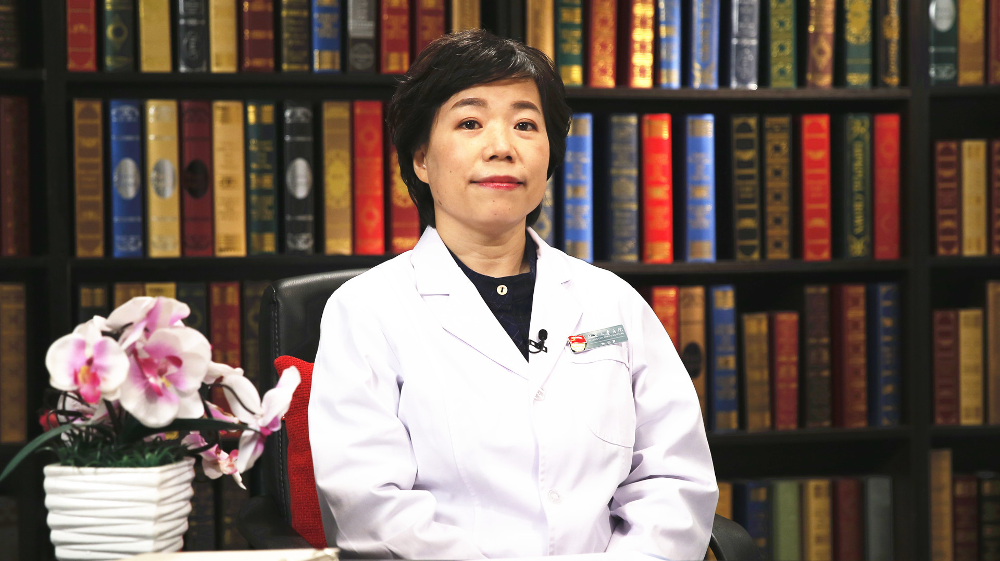

# 2.29 儿童可弯曲支气管镜

---

## 焦安 夏主任医师

首都医科大学附属北京儿童医院介入肺科副主任 主任医师 医学博士；

中华医学会儿科学分会呼吸学组儿科支气管镜协作组副组长；中国医师协会内镜医师分会儿科呼吸内镜专业委员会副主任委员；国家卫生计生委医政司儿科呼吸内镜专家组成员。

**主要成就：** 培养儿科支气管镜专业医师两百余名；发表论文20余篇；参编著作多部；2012年获中华医学会儿科分会颁发的“儿科支气管镜临床应用和技术推广先进医师”称号。

**专业特长：** 多年来致力于儿科支气管镜诊疗术的推广应用，主要研究方向为呼吸系统疾病及儿科支气管镜的临床应用。擅长儿科难治性支气管异物、支气管结核、重症肺炎、塑型性支气管炎、支气管哮喘、良恶性中央气道狭窄的介入治疗等，具丰富的诊疗经验，累计手术万余例次。

---

## 什么是儿童可弯曲支气管镜？它的作用是什么？

（采访）您能给我们详细的介绍一下什么是儿童可弯曲支气管镜吗？

可以，可弯曲支气管镜，它也是咱们俗称的软镜，相对于硬镜来说的，像耳鼻喉科他们用的是硬镜，就是一根钢管，需要直直的进到气道内。

可弯曲支气管镜是有角度的，它的左手边有一个调节的柄，可以前屈，可以后仰一定的角度，可以很灵活的进入声门，进到气道里面，而且可以保持居中的状态，尽量可以不碰到气管支气管的壁，这样减少对气道的刺激。在儿科来说还是非常安全的。

（采访）可弯曲支气管镜它的作用是什么？是检查用，还是治疗用？

检查、治疗都有，最早先是检查用，因为有一些孩子比如说咳嗽，反复咳嗽，或者是喘息，一开始的时候你要怀疑气道有没有畸形，有没有软化。狭窄的话用影像是可以去了解，但是是不是软话的话，因为随着他的呼吸，它是一个动态的过程，你只能是通过支气管镜下来观察。吸气的时候和呼吸的时候，管腔是不是有塌陷，来判断是不是有软化。

现在做的检查除了了解气管的结构，比如说气管有没有异常开口，是不是狭窄，是不是有软化。

另外现在很多疾病需要了解腔内有没有东西阻塞，比如说呛个花生，呛个瓜子，有没有异物阻塞。

另外现在像肿瘤也低龄化，气道内有没有占位，都可以通过支气管镜检查去了解气道通畅不通畅，有没有狭窄、软化、畸形这些结构的异常。

另外还有感染的时候，有一些孩子黏膜非常红肿，是不是有出血，是不是有分泌物的阻塞，甚至有一些重症的孩子会有支气管塑形，就像支气管束一样的粘液栓吸出来，散开了以后像珊瑚一样完全阻塞在气道内，它也是一个检查的指征，虽然是检查，诊断了之后马上就要治疗，就要把它取出来。还有一些狭窄，我们现在有些介入治疗的方法也是在治疗的范畴。

---

## 儿童可弯曲支气管镜有哪些种类？医生经常使用的是哪种？

（采访）适用于儿童的可弯曲支气管镜有哪些种类？

最早的是纤维支气管镜，后来发展到电子支气管镜，纤维支气管镜是光导束传导的，它可以做到很细。因为它占用的管径的体积不大。

后来发展的是电子支气管镜，像成人的电子支气管镜，外径可以达到6.5毫米粗，但是儿童，像新生儿，气道直径才六个毫米，用那么粗的镜子肯定就不行。

原先的电子支气管镜没有足够细的镜子，所以它们折中了一下，一部分还是用纤维光导束传导，一部分是用数字摄像系统。因为数字摄像系统它很占体积，它们俩结合之后，既可以保证一定的清晰度，因为电子镜在传导的过程中，图像是很少衰减的，所以它跟纤维镜的比起来很高清。

像纤维镜有的时候尤其打光束断了以后影像会模糊，影像会比较暗，照出来的图片会有些失真，结合镜就结合两者的优点，它又能保证一定的管径细，适合于儿童。

最细的现在外径是2.8毫米，可以做到早产儿，最小的大概做四斤的孩子，就是两公斤的孩子都可以用这个镜子来做，所以还是很有优势的。

（采访）所以就是有纤维支气管镜和电子支气管镜，还有结合型支气管镜？

对。

（采访）我们说的可弯曲支气管镜是哪种呢？

三种里边都是可弯曲支气管镜，可弯曲支气管镜里边它分纤维的，分电子的，然后分两者结合的，就是结合型的。

（采访）目前在我们临床上应用最多的是不是结合型的支气管镜？

对，它既能保持一定的高清度，它又能够做到比较细的外径，所以结合型支气管镜现在是最常用的。

但是随着电子镜开发的发展，这种电子元件CCD（电荷耦合器件）越来越细，现在也有比较细的纯电子镜开始生产，像我我目前了解的最细大概是3.1毫米支气管镜，也可以用到新生儿了。

---

## 儿童哪些情况可以使用可弯曲支气管镜进行检查？

比如说反复咳嗽的孩子，不明原因的，可能有一些咳嗽是因为鼻炎、咽炎，但有一些咳嗽是很深的，可能是反复的呼吸道感染、反复的肺炎，或者是还有一些喘息的孩子，尤其是活动后喘息的孩子，就是运动不耐受，一活动就会喘，这个时候你就要怀疑是不是气道有问题。

气道不够通畅，可能是分泌物堵，可能是结构异常，也可能是有占位，有的是咯血的孩子，不是呕血，是从气道里边痰中带血，甚至咯鲜血，你要判断血是从哪来的。

支气管镜可以从鼻腔、声门，一直看到气管支、气管，一个是可以判断出血的部位，另外还要看结构上，内膜上血管有没有异常，还有有些孩子咯血其实是异物或者是肿瘤，通过支气管镜检查都可以直观的看到。

还有我们做检查根据的是影像学的异常，比如说我有肺炎了，反复的肺炎或者是有肺不张，还有肺气肿。像肺不张提示的就是这一支管腔都是不通畅的，所以它出现的是不张。肺气肿就是这一支的堵塞是不完全的，它还能进一部分的气，都是气道受阻的表现，就需要支气管镜去帮助判断到底是阻塞在哪了，什么原因阻塞的，是腔内的东西阻塞的，还是管外的东西压迫的。

因为有些心血管异常的孩子也会压迫气道，甚至食管异常的孩子也会压迫气道，所以你了解一下，到底是腔内的原因，还是腔外的原因。这都是我们检查的指征。

还有一部分做检查是为了获取标本，比如说咳嗽很长时间，肺炎很长时间，但查不到病原，我就需要做检查来获取灌洗液，有的要做活检，取到黏膜标本、肺组织的标本，甚至纵膈里边淋巴结的标本，去做病理来协助诊断。这是需要检查的适应证。

（采访）就是不明原因的咳嗽、咯血、肺不张、肺气肿、肺炎这种情况都需要使用儿童可弯曲支气管镜进行检查？

对。

（采访）这样就能发现病因是什么？

对，尤其是肺不张的病因，是需要支气管镜来协助帮它判断的，到底阻塞的性质是什么，是腔内的还是管外的，还是本身发育的问题。

---

## 儿童哪些疾病可以使用可弯曲支气管镜进行治疗？

（采访）对于儿童哪些疾病可以用可弯曲支气管镜进行治疗？

儿童跟成人需要支气管镜介入治疗的疾病谱是不一样的，成人很多都是肿瘤，气道的肿瘤是绝大部分需要治疗的。但对儿童来说还是良性病变，像重症肺炎，尤其是在肺炎里边像支原体肺炎，或者一些病毒肺炎，如果离开支气管镜的话，可能治疗效果还有预后会大打折扣。

因为支原体肺炎或者是腺病毒肺炎从某种意义上来说，它是气道疾病，黏膜的损害会比较明显，支气管塑形就会出现这些肺炎里面，大量的分泌物堵塞，或者是支气管的塑形粘液栓堵塞。一般的呼吸道的管理，雾化、排痰很难把气道里边的阻塞缓解，所以用支气管镜做治疗，直接去灌洗，去冲洗，就像疏通管道一样把气道通畅，这是最常见的方法。

还有像支气管异物，像呛了花生、瓜子，甚至钉子，一些包罗万象的东西，很多婴幼儿，尤其是三岁以内的孩子，吃坚果之后容易呛到气道内，也是我们比较常见的适应证。

另外还有支气管结核，因为现在肺结核在儿童并不少见，有一些原发性肺结核没有得到及时治疗，淋巴结的结核会破溃到气道内，就像干酪一样，其实是一个内生性的异物，它破溃到气道内就是需要支气管镜把它给清除干净，否则的话它可能就会过渡到像成人那种内膜结核，狭窄、挛缩，甚至是鼻塞，甚至是危及生命的，所以都需要支气管镜来介入治疗。

还有最近几年新兴的，我们介入范围，治疗范围在拓展，像良性的、恶性的中央气道狭窄，比如插管后声门下瘢痕增生狭窄，我们现在可以用激光，可以用冷冻来治疗，基本上恢复到正常的管腔，恢复正常的生活。

像以前如果没有这种治疗的话，可能只能做气切了，就是把气管切开。但是现在有这种方法就可以在不切开气管的情况下，去做微创治疗，就能达到一个很好的生活品质，还给他一个很好的童年。

还有像气道内的肿瘤，原先一部分可能需要到胸外科去切。现在我们可以做腔内的微创治疗。

（采访）您有提到说肺炎是可以用可弯曲支气管镜进行治疗的？

对。

（采访）其实小婴儿都有可能得肺炎，是不是轻度肺炎也可以用，重度肺炎也可以用？

还要有指征的，轻度的肺炎如果没有大片的肺不张，没有气道阻塞的表现，我们是不做支气管镜的。因为毕竟它虽然安全，虽然微创，它还是一个有侵袭性的、有创的检查治疗。

一般的轻症肺炎，我们通过呼吸道的管理，比如说给化痰药，给抗生素，给雾化治疗，他可能就会改善了。但是重症的，一般的雾化治疗很难把气道的分泌物清除出来这时候就需要介入的辅助治疗了。

---

## 儿童可弯曲支气管镜是如何治疗肺炎的？

肺炎的治疗，主要用到的就是支气管肺泡灌洗术，一般来说我们会用37度的生理盐水，每公斤体重1-3ml，有时候会到5ml，计算出液体总量来做灌洗。可弯曲支气管镜，它就可以先嵌到病灶的管口，把生理盐水打进去，然后把里边的分泌物抽吸出来。

真正意义上的支气管肺泡灌洗液，它是要求灌洗到公斤体重3ml的，因为这种液量把肺泡里边的细胞成分，还有炎性介质都已经置换出来了，可以用来做科研，可以用来临床上来分析，炎症的这种细胞，还有炎症因子，就是帮助分析疾病的发展的状态，也是检查的一种，就不单是治疗了。

---

## 儿童可弯曲支气管镜治疗重症肺炎的效果怎么样？

如果就是分泌物阻塞，或者是就是支气管塑形，可能会有一个立竿见影的效果，就像塑形，前一阵像甲流的孩子重症肺炎，或者有一些支原体的孩子重症肺炎，还有一些腺病毒的孩子上着呼吸机，他的呼吸都非常困难，插着管上呼吸机参数非常高，气道压力下不来，我们就在床边紧急去做支气管镜。

这个时候你可能把塑形取出来了，立刻呼吸机的参数就降下来了。可能第二天就脱机了，改成鼻导管的吸氧了。所以它的效果还是非常好的。

但是对一些重症的，本身不单纯是气道病变的肺炎，灌洗可能只是辅助它的一部分，不会解决所有的问题，还需要全身的抗炎，呼吸道的管理，这些所有的综合的治疗，它是作为一个很重要的辅助的手段。

（采访）对于儿童肺炎，它的问题主要就是气道问题的时候，我们用可弯曲支气管镜的治疗效果是很不错的，但是如果有其他的问题它只是一个辅助的手段？

对，但是是一个重要的辅助手段，它可以有效的改善预后，缩小病变的范围。

---

## 儿童不小心将异物吸入气管，可以用可弯曲支气管镜来取吗？

（采访）儿童因为他比较调皮，可能一些东西他不知道是不能吃的，可能会吞咽下去，您遇到过有没有吞进去钢镚儿需要用支气管镜取出来的？

钢镚儿它一般很难进到气管里边，它一般都是会进到食道里边，我们见过五分钱的钢镚儿进到食道内，但通过食道破溃到了气道内，这个是可以的。但也有一些像小的物品，声门能够通过下去的物品，会直接呛咳到气道内。比如说纽扣电池，纽扣电池可以直接呛入到气管里边，它会腐蚀，形成气管食管瘘，气管的后壁就会破溃了。

（采访）您用可弯曲支气管镜取出过什么东西？

很多，坚果类的是最多的，花生米、夏威夷果、碧根果。早先像50年代的时候呛的都是黄豆，现在呛的是非常高级一点的坚果了，就像开心果、碧根果、夏威夷果、核桃，各种壳，像花生壳，甚至核桃壳，还有松子的壳，还有荔枝壳。

我们见过一个大孩子荔枝壳就卡在声门下，一直在外面按哮喘来治，就是喘，找不到原因，片子也正常，后来我们就做支气管镜，一看就卡在声门下，贴着气管的后壁那个地方，一个荔枝壳在那个地方，所以把它取出来就好了。

（采访）为什么儿童会多出现这种气道内呛咳的现象，是不是因为气道比较窄，所以容易卡住了？

不是，三岁以内的孩子最常见，因为三岁以内的孩子他的咀嚼的功能是不完善的，所以他嚼不碎。而且尤其是哭闹的孩子，在吃东西的时候打闹、哭闹，还有强行喂食的孩子，他会呛咳。或者有的孩子嘴巴里含着东西突然摔了一跤，也会呛进去。

像大孩子，学龄期的孩子一般笔帽多见，就是十几岁的孩子，有七八岁的孩子，他会把铅笔的笔帽含在嘴巴里边，有的时候他玩，塞在鼻孔里面，然后跟同伴一打闹，就呛到气道里面了。

我们曾经见过一个七岁的孩子路上捡了一个玻璃球，然后就进了气道了，特别大的一个玻璃珠，也是我们通过软镜，可弯曲支气管镜把它取出来。

（采访）您能给宝妈，尤其是三岁以前的宝妈一些建议来防止孩子出现这种情况吗？

可以的，三岁以前是建议不吃坚果的，一定不要给坚果吃。另外就是像一些小零件，他可以含到嘴巴里有可能呛进去的药片儿、药丸儿，还有玩具上的小零件一定要放在他够不着的地方。有可能他会吸入的东西都要放在他够不着的地方。

---

## 儿童大量咯血可以用可弯曲支气管镜抢救吗？

（采访）当儿童出现咯血情况的时候可以用支气管镜进行治疗吗？

首先要检查，判明咯血的原因，比如说一口血痰少量的出血，我们会首先选择做支气管镜，先去看他的出血灶在哪，也可能是在鼻咽部，也可能是在气管、支气管。但如果是大的咯血，一天大约一百毫升的咯血，我们肯定是不会先去做支气管镜，要先查原因。

因为像这种大的咯血，有可能是血管畸形，可能要先去做增强肺CT或者是做支气管动脉的造影。像有好多孩子是支气管动脉-肺动脉瘘，或者是支气管动脉的肺静脉瘘，它是一个动静脉的瘘，是一个异常畸形，它有一团的血管在那个地方。所以如果碰它的话会出现大的咯血，所以这种情况下我们一般是先做检查，先做血管的栓堵，然后我们再去做检查，再去看它的部位。

还有我们曾经抢救过大咯血，支气管动静脉瘘的，他来了之后突然大咯血，咯血量达到2000毫升，当时如果没有支气管镜的话，可能孩子就窒息了。

因为当时一定要让支气管镜快速进去，然后没有出血的那一侧的支气管保持通畅，让它通气，然后再用局部的止血药，当时是左下的出血，把左侧的止血药放进去，让它形成血栓，很长时间才止，大概一个小时。同时全身输液，建立静脉通道，保持体液不要丢失，不要休克，这个时候我们才赢得了时间去做栓堵，最后这个孩子还是挺好的。

---

## 哪些儿童不适合做可弯曲支气管镜？

（采访）是不是所有儿童都可以做可弯曲支气管镜检查呢？

技术层面上是没有问题的，因为现在最细的外径是2.8毫米，我们可以做到早产儿，最小的体重大概两公斤，早产的孩子，像小猫一样，他的气道也可以用支气管镜做。当然一定要看他是不是适合做，还要严格把握它的适应证来做。

（采访）哪些儿童不适合做像？

有严重的出凝血障碍的，像血液科的病人，有的时候血小板连1万都不到，这个时候肯定是不能做的，如果要做的话就需要去创造条件，就要输血小板，要输到5万以上我们才会给他做。

还有一些相对的禁忌证，比如说他的心肺功能特别差，这也是属于不适合做，还有营养状态特别差的。另外还有肺动脉高压的孩子。但是相对而言权衡利弊，因为有一些像肺功能特别差的，他是因为气道梗阻引起的，你首先可能还是要去解除气道梗阻，防止疾病进一步的进展，所以它属于相对的禁忌证，并不是绝对的禁忌证。

---

## 儿童做可弯曲支气管镜前，需要哪些准备？

（采访）做儿童支气管镜检查前，我们前面需不需要特别准备什么？

需要，比如说对孩子的准备，首先他要做一些相关的检查，比如说血常规、胸片，还有传染病那一类的检查，因为毕竟是一个有创的，是一个侵入性的检查，所以像乙肝、丙肝、梅毒、艾滋，包括结核这些抗体都是要查的，比如说呼吸不太好的孩子我们还会查血气分析，还要查心电图。心电图要保证他没有相关的心脏疾病，会影响操作，会给他带来不良的反应的。这是孩子的检查。

术前还需要禁食水，我们一般禁食水是6到8个小时，就是不吃东西不喝水，当然喝一点水术前两个小时可以，仅仅是喝水，这是禁食水的概念。

还有术前针，我们做局麻的话要打术前针，像阿托品，然后我们做的当时会给他镇静的药，像咪唑安定，这种镇静药逆行性遗忘会比较明显，过后他不太会记得他做的这种操作的感觉，一般不太会记得，这是术前的准备。

当然对我们医生来说要了解他是不是要做，为什么要做，做的目的是什么，这是我们需要做的。

---

## 儿童可弯曲支气管镜是如何操作的？风险大吗？

（采访）儿童可弯曲支气管镜是如何操作的？

一般局麻下操作的话经鼻的比较多，就是经鼻孔，然后经过后鼻道到声门，然后进到声门里边，到气管，然后到左右主支气管，再到支气管下面的段支气管，段支气管下面还有亚支、亚亚支、亚亚亚支，这种特别细的支气管。

因为我们2.8毫米的镜子，像大孩子的话就可以进到很深了，所以根据你需要看到多深，决定你检查的范围。

（采访）是从鼻子进去的吗？

从鼻子进去比较多，但有一些时候比如说我们是要做治疗的，比如说我们取笔帽，取笔帽的话就经鼻子，取了之后就没有办法从鼻子取出来，因为鼻腔不够大，所以我们会带一个口嘴，从嘴巴进镜子，然后取出来笔帽的时候直接就从嘴巴出来了。

（采访）这个是有创的，还是无创的？

它属于微创，因为它是顺着自然的管腔下去的，不是说像外科，我要切开皮肤进到腹腔。因为管腔是自然的管腔，所以属于微创的治疗。

（采访）在这个过程中会不会出血？

很少，如果说是由支气管镜这种操作本身引起的出血非常少，但是也有一些孩子，比如说鼻粘膜比较干燥的孩子，从鼻子进去的时候可能会有鼻出血。还有本身就是习惯性鼻出血的孩子，可能稍微一碰他，再加上他禁食水6-8个小时，他鼻粘膜更干燥，补充的水补充的不够，也会引起鼻出血。鼻出血是我们最常见的。

当然一些特殊的病人，比如说有异物的，异物堵了很长时间，局部很烂了，支气管镜进去你可能只做灌洗都会引起他局部的出血。但是这种出血都是可控的，我给一点止血的药他就会止。但是如果像血管畸形的，有些就是不可控的。

（采访）在这个过程中患者会不会感觉到很痛苦？

其实气道里边是没有痛觉神经的，但是他会有咳嗽反射，会出现咳嗽，有的时候进气道的一刹那，他可能会有喘憋的表现。所以我们一般给他局麻，这样进去的时候不会有太大的感觉。

另外还有镇静，镇静的状态下，发生气管痉挛的可能性会比较小，出现刺激性干咳的可能性也会比较小，而且我们做的过程当中还会给局麻药，比如说到气管的分叉的地方或者是再到左边、右边，根据他咳嗽的情况，再给他局麻的药物都会减轻副反应，从他的感觉上会好一点。

（采访）我们在用可弯曲支气管镜进行检查的过程中一般需要多长时间？

短的如果只是一个检查，可能5-10分钟就结束了。如果说是治疗的话，需要的时间就长了，我们一般需要半个小时左右，或者是做介入，比如说要切一个气道内的肿瘤，甚至可能得需要一个多小时。

（采访）您提到的是局麻，没有全麻吗？

有全麻，全麻放在什么样的孩子？一个需要他绝对配合的。还有一个，孩子本身很抗拒局麻的，因为有些大孩子他有自主意识了，局麻的话你根本不可能把他摁到手术床上，因为他非常抗拒。这个时候可能就需要全麻下来做，可能更人文一些。

还有一些介入治疗是一定需要全麻下做的，因为需要孩子的绝对配合，需要术中有效地保障他的通气。比如说我们需要做激光、冷冻、球囊，甚至放气道内的支架，这些都是要在全麻下做。

---

## 儿童经支气管镜活检术是怎么回事？目的是什么？

（采访）儿童经支气管镜活检术是怎么回事？

一般从支气管镜下，我们通过支气管镜操作孔道，用活检钳或者是细胞刷来做活检，这是活检术。就是取黏膜标本，或者是细胞的标本，或者是纵隔组织的标本。

它具体分很多种，像取细胞叫刷检术，用细胞刷在管壁上刷检以后做涂片，这是一种。大部分来说是用活检钳，我们用活检钳可以直接取支气管的黏膜，就是我可视的情况下去取黏膜。

还有就是透壁的肺活检，我伸到支气管的远端的远端细支气管部位，我的活检钳会穿透支气管取到肺组织，叫透壁肺活检。

还有针吸活检，在纵隔内比如说有淋巴结肿大，比如说有肿瘤的占位，我可以通过支气管镜，通过很准确的定位，比如说我用增强肺CT可以看它跟气道的相关性，相邻的位置，可以做透壁的针吸活检，这都属于活检术的，支气管镜目前可以做的透壁活检的范畴。

（采访）其实经支气管镜活检术就是为了取标本？

对，取病理为了明确诊断，一般像黏膜活检最常用的是什么？原发性纤毛运动障碍，有一些孩子反复的咳嗽，然后气道里边会有大量的分泌物，有可能不是因为感染引起的，也不是因为单纯的肺炎本身引起的。可能是因为本身的纤毛摆动障碍。

有些孩子他先天性的，咱们呼吸道的表面是有一层纤毛的，它会不断的朝一个方向摆动，把深部的痰液、脏东西，气道里的分泌物把它排出来，推出来，你可以咳出痰来。

但那种孩子他是没有办法咳痰的，因为他没有正常的纤毛摆动，所以我们一般是通过黏膜活检，然后送电镜检查来看纤毛结构来判断，来帮助他诊断。

---

## 儿童做完可弯曲支气管镜会有什么不适的感觉？

（采访）儿童在刚做完可弯曲支气管镜会不会感觉到不适？

会有一些咳嗽，但是大的不适应该没有，但是也要注意并发症，有时候根据他的情况，像普通的检查或者是普通的肺炎灌洗，一般出现明显的并发症的很少。

但是如果说像做一些介入的治疗，有可能会出现，比如说他会出现剧烈的咳嗽，比如说出现气胸的时候，或者会出现出血的时候，会有剧烈的咳嗽，或者会出现呼吸困难。所以我们术后是会给他四小时的监测。

（采访）就是单说做检查来说，其实对孩子的身体健康完全没有影响？

不能说完全没有影响，因为他做这一项检查需要禁食水6-8个小时，对他来说其实本身算是一重打击。

它毕竟还是侵入性的治疗，侵入性的检查，像支气管镜进入气道之后会刺激气道，它也可能会刺激迷走神经，有的时候会引起相关的症状，比如说心率减慢，但是术前针的作用就在于这，我们会事先给他阿脱品，为了防止他出现心率的减慢。

但是术后一般如果我们严密观测的话，都是会比较平稳地度过的。

---

## 儿童做完可弯曲支气管镜后，需要注意哪些事情？

一定要严密的监测他的生命体征，最常见的监测的指标像呼吸、心率、血氧饱和度，另外还有血压。如果他出现了呼吸增快、呼吸困难，或者是血氧饱和度维持不了，是一定要找原因的。要看他有没有出现并发症。

（采访）是不是做完儿童可弯曲支气管镜是需要住院的？

是的，他需要术后的四小时的监测，如果在门诊的话就很难做到，没有人力去做四小时的监测。所以住院一般来说分两种，一个是日间的病房，就是一日病房，他做完了我监测四个小时，他需要办住院手续，当天来给他做，然后做完了之后观察4个小时可以当天回去，这是最方便的。

一些轻症的病人比如说一般状况很好，耐受很好，可以通过一日门诊，可以大大节约我们病房的床位。当然重的肺炎，需要长期治疗的，是需要住院治疗的。

（采访）我们对于轻微的四小时监测完全没有问题，回到家了还需不需要定期来复查？

看情况，有一些孩子，比如异物的孩子，呛完花生米之后，呛的时间比较长，呛完了之后虽然异物取出来了，但是有肉芽，异物在那个地方，刺激管壁增生的肉芽，还有局部的化脓感染，像这种情况我们会建议他一周以后还要来复查。

（采访）对于单单检查的是不是就不需要了？

对，单单检查的话一般不再需要做第二次。一般需要做第二次的基本上都是治疗的。

（采访）我们在使用儿童可弯曲支气管镜术后，出现哪些事情要特别警惕？

术后比如他出现呼吸困难了，出现血氧饱和度不能维持了，还有出现咯血了，不是那种痰中带血，如果说做完了之后有一点点血丝是可以忍受的，还在正常范围内，但是如果有咯的鲜血，一定要去查找原因了。

（采访）是不是这些都在四小时之内会发生？

有一些不在，比如说他会有咯血，他早期也可能就很少量，他还没有咯出来，回家之后也有可能会出现。所以常规的我们还是要判断，他会不会有这种倾向，如果有这种倾向的话，我们一般不会让他走，还会留。

比如做了治疗的孩子，像支气管结核，我去给他夹，夹到干酪样物，把它给清除，清除的过程中如果有出血的话，我们一般都不会让他四个小时就走。转到大病房去住院留观，至少要观察24小时才会走。

（采访）其实所有家长最担心的是我家孩子做可弯曲支气管镜，会不会伤到气管？

因为毕竟是一个管样的东西，支气管镜进入气道，比如说有的时候孩子咳嗽或者是会碰到管壁，这是很难避免的。还有灌洗的时候做吸引的话可能也会刺激到管壁，可能管壁会有一点点擦。比如说发红了这种损伤。但是说如果支气管镜本身对气管的损伤应该是可以避免的。

（采访）术后多长时间这些可以恢复？

一般要这种修复至少3天，24小时之内就不会有太明显的咳嗽。但如果说是黏膜本身的损伤比如说擦伤的话，可能需要3天的时间也会修复，而且这种擦伤对他来说是忽略不计的，因为他没有什么自觉的症状。

---
