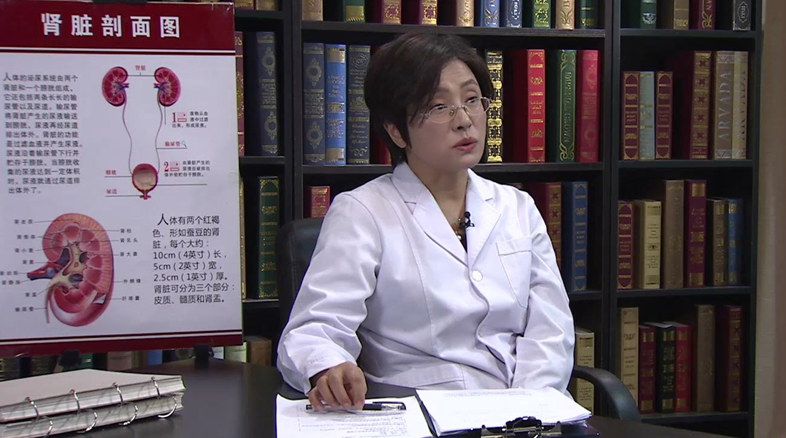

# 儿童慢性肾脏病及肾功能衰竭

---

## 陈朝英 主任医师

首都儿科研究所肾脏内科主任 主任医师 硕士研究生导师；

中华医学会儿科学分会小儿肾脏病学组委员；北京医学会肾脏病分会委员；北京医学会儿科分会肾脏病学组副组长；中国医师协会儿科医师分会小儿肾脏病专家委员会常委；中国医师协会儿科医师分会小儿血液净化专家委员会常委。

**主要成就：** 发表文章40余篇。

**专业特长 ：** 从事儿科临床工作20余年，擅长儿科肾脏疾病及遗尿症的诊断和治疗。
