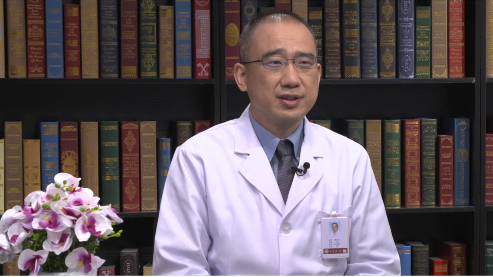

# 儿童难治性癫痫

---

## 姜玉武 主任医师

北京大学第一医院儿科主任及儿童癫痫中心主任，主任医师，教授；

北京大学医学部儿科学系主任；国际抗癫痫联盟遗传委员会委员；国际儿科神经学会特邀理事；中华医学会儿科学分会副主任委员及脑科学委员会主任委员；中国抗癫痫协会常务理事兼青年委员会主任委员；中国医师协会医学遗传医师分会副会长；中国医师协会儿童神经疾病专业委员会主任委员；国家卫健委全国出生缺陷防治人才培训项目遗传病诊治专家组组长。

**主要成就：** 完成11项国家及部委级基金项目；获2012年宋庆龄儿科医学奖；2015年科技北京百名领军人才；获2017年中国儿科医师奖、中华医学科技奖二等奖、北京市科学技术奖二等奖。

**专业特长：** 研究方向为儿童癫痫及相关发育性脑疾病（遗传性癫痫、智力障碍及相关神经遗传病）的分子遗传学及神经生物学发病机制。

---
