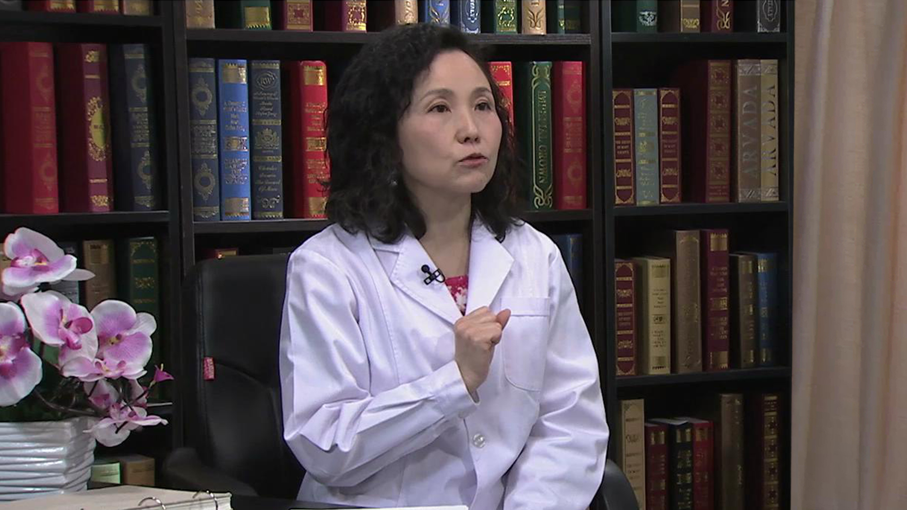

# 儿童身高促进

---

## 蒋竞雄 研究员

中国疾病预防控制中心妇幼保健中心儿童保健部研究员 硕士生导师；

中国优生科学协会常务理事；中国优生科学协会小儿营养专业委员会常务副主任委员；中国医师协会儿童健康专业委员会常务委员；中国妇幼保健协会专家委员会委员；国际肥胖工作组科学咨询委员会委员；中国保健协会儿童早期发展专家委员会委员。

**主要成就：** 在国际和国内一类学术期刊发表专业和科普文章数十篇，出版著作多部；在儿童保健领域多次承担卫生部及世界卫生组织、联合国儿童基金会、世界银行、澳大利亚国际开发署等国际组织的合作项目和课题；作为主要负责人参与国家有关儿童保健工作规范和技术规范的制定；参与国务院《儿童发展纲要（2011-2020）》的制定；作为主要撰稿人负责国家基本公共卫生服务规范中《儿童肥胖干预技术规范》的制定和国家卫生计生委妇幼司《0-6岁儿童肥胖筛查和预防技术规范》的制定。

**专业特长：** 从事儿科临床、儿童保健工作三十余年，主攻儿童营养和生长发育，在儿童肥胖干预、婴幼儿喂养、儿童身高保健和身高促进、营养评价、婴幼儿过敏预防、儿童保健服务市场开发等方面有独到的见解和丰富的实践经验。

---
