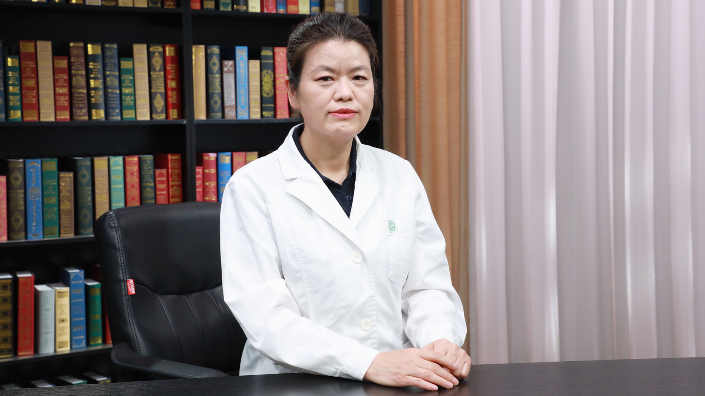

# 儿童神经母细胞瘤病理检查


---

## 邹继珍 主任医师



首都儿科研究所附属儿童医院病理科主任 主任医师 硕士生导师；

中华医学会病理学分会儿科学组委员；中华医学会儿科学分会呼吸学组儿童间质性肺疾病协作组委员；中国抗癌协会儿科学组委员；中国抗癌协会妇幼病理学组委员；北京抗癌协会小儿肿瘤组委员；诸福棠病理专业委员会委员。


**主要成就：** 发表了多篇核心期刊论文，获得多项科研成果，如北京市科技进步三等奖（第二作者）、宋庆龄儿科基金会儿科医师奖（第四作者）、中华医学科技奖（第四作者）、北京医学科技奖（第三作者）等；承担了多项科研课题，如国家科技部973课题-山西“健苗”工程，分课题“山西吕梁地区围产儿出生缺陷的监测及临床病理研究”等。


**专业特长：** 毕业后一直从事病理教学、科研及临床病理诊断工作，已30多年，具有丰富的工作经验；擅长儿童实体肿瘤和淋巴造血系统肿瘤等方面的工作。

```

```
