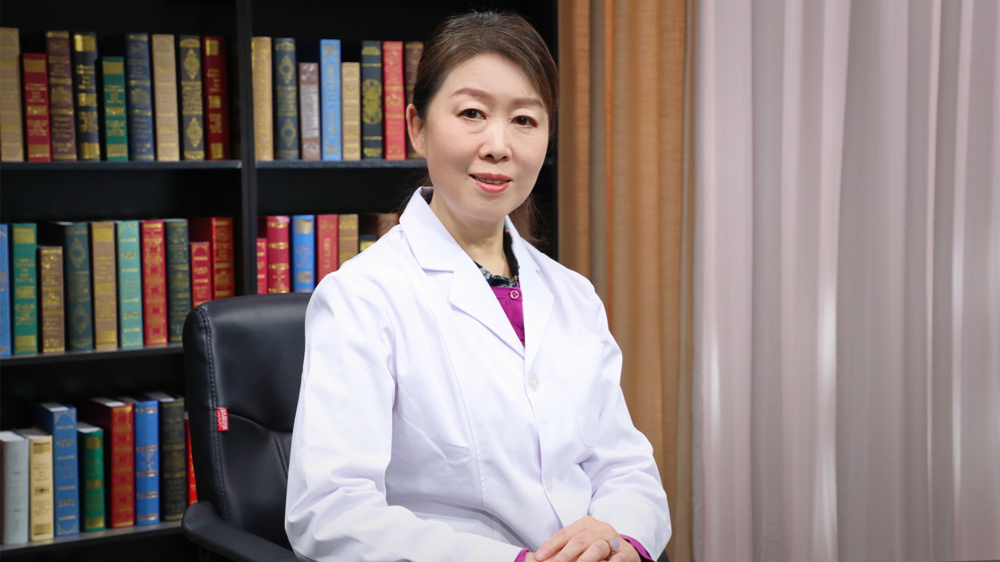

# 儿童身高、体重、智力发育迟缓

---

## 刘莉 主任医师

首都医科大学附属北京儿童医院儿童保健中心主任医师 知名专家；

中国妇幼保健协会自闭症防治专业委员会副主任委员；中国妇幼保健协会儿童疾病和保健分会委员；中国中药协会儿童健康与药物研究专业委员会儿童保健学组副组长；中国医疗保健国际交流促进会妇儿医疗保健分会常务委员中国医疗保健国际交流促进会出生缺陷精准医疗分会委员；《中国儿童保健杂志》编委。

**主要成就：** 主持和参加的项目有：美泰儿童基金会支持项目“儿童发育研究”，中国CDC合作课题“婴儿胃肠道常见问题筛查干预项目”，美国惠氏基金支持项目“儿童喷鼻型流感疫苗临床研究”，“婴儿泥糊状食品添加效果观察”等；在核心杂志发表论文数十余篇；主编儿童保健科普书一部，副主编一部；参编及翻译儿科学书籍五部，参编育儿书籍，撰写科普文章共计二十余万字。

**专业特长：** 擅长生长迟缓、矮小、精神发育迟缓、孤独症的诊断和治疗，发育行为指导与干预，婴幼儿喂养，特殊健康状态儿童免疫规划，常见营养性疾病的诊断及治疗等；工作30余年，具有丰富的儿童保健及儿内科临床工作经验，特别在儿童精神发育迟滞、孤独症的诊断与治疗方面经验丰富。

---
