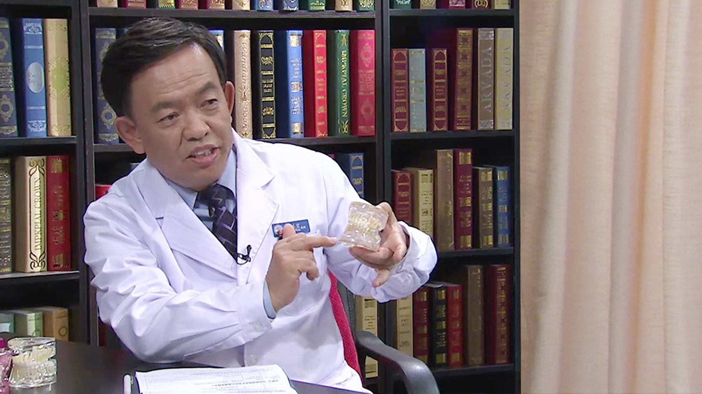

# 儿童替牙期错颌畸形

---

## 葛立宏 主任医师

北京大学口腔医学院主任医师 博士研究生导师 教授；

中华口腔医学会理事；北京口腔医学会镇静镇痛专业委员会名誉主任委员；北京市健康教育协会口腔医学专业委员会主任委员；第三 四届儿童口腔医学专业委员会主任委员；亚洲儿童口腔医学会副会长；亚洲牙齿外伤学会副会长。

**主要成就：** 主持国家自然科学基金等科研项目16项；在国内外杂志发表学术论文91篇；主编主译著作9部，参编著作11部。

**专业特长：** 擅长儿童牙齿发育异常的诊治、咬合诱导、牙齿外伤、婴幼儿龋病的综合防治以及全身麻醉下儿童牙病治疗等。

---
