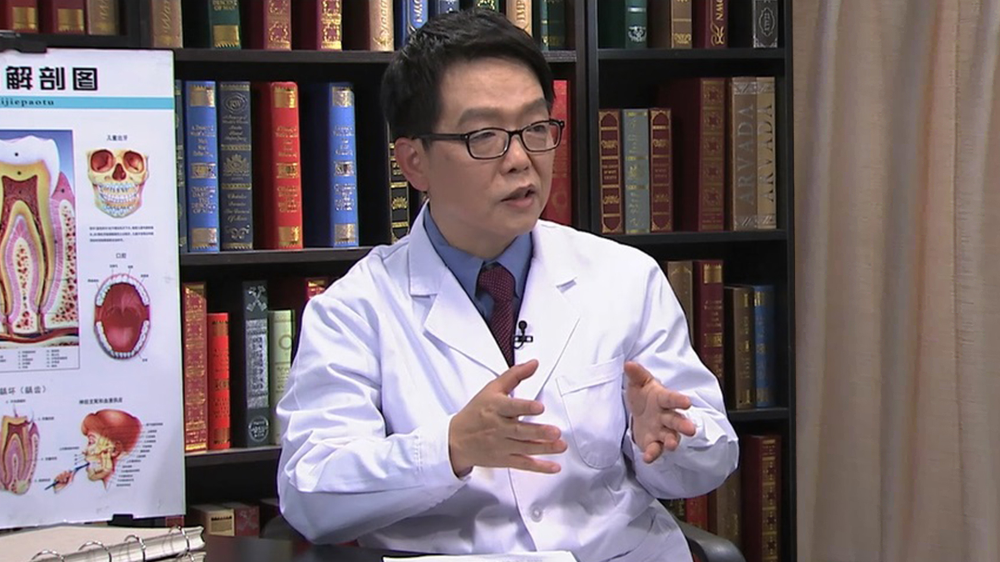

# 儿童牙髓及根尖周病

---

## 宋光泰 主任医师

武汉大学口腔医院儿童口腔科主任 主任医师 研究生导师 医学博士；

儿童口腔医学教研室主任 ；国家临床重点专科建设单位学科负责人 ；中华口腔医学会儿童口腔医学专业委员会第三、四届副主任委员 ；武汉口腔医学会常务理事兼秘书长 ；湖北省儿童口腔医学专委会主任委员 ；亚洲儿童牙科学会（PDAA）理事（2008-2016） ；国际儿童牙科协会（IAPD）会员。

**主要成就：** 发表学术论文30余篇，SCI论文6篇，参编专著7本；培养硕士研究生20人；获第六届国家级教学成果奖二等奖。

**专业特长：** 擅长于儿童口腔疾病的诊断、治疗及预防，负责和参加了本科生、研究生等多层次教学工作，对PBL教学有较多研究。尤其对儿童年轻恒牙牙髓治疗、儿童口腔遗传病等有较深入的研究。
