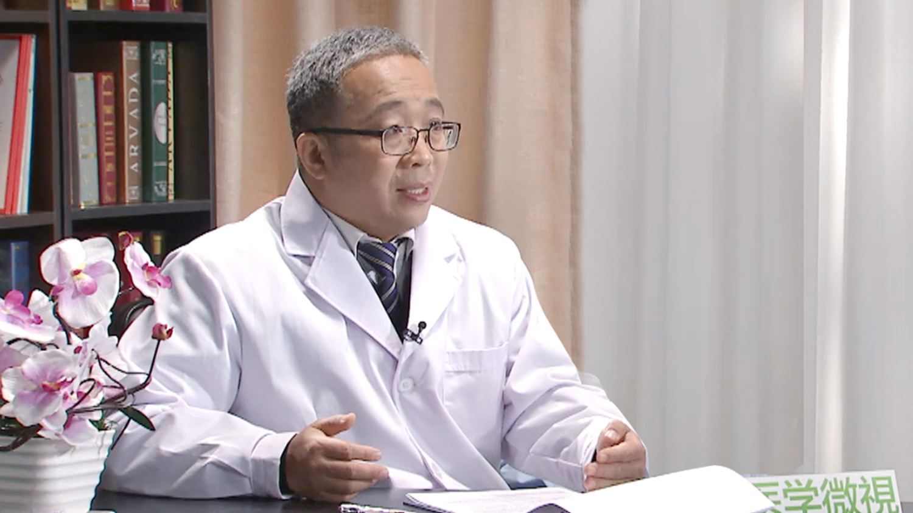

# 儿童抑郁症

---

## 刘华清 主任医师

北京大学回龙观临床医学院主任医师 教授 临床心理科主任 兼任儿童心理科主任；

中华医学会儿童和少年精神医学专业委员会委员；中国心理卫生协会心理咨询与治疗专业委员会委员；中国性学会性心理专业委员会常委；曾任首都儿科研究所专家门诊部儿童青少年心理咨询中心主任、抑郁症专家门诊主任；曾任北京市科委科研立项评审专家；曾任科技部卫生科研专项评审专家；曾任国家自然科研基金评审专家。

**主要成就：** 目前主持国家级继续教育项目：中法精神分析取向心理治疗师连续培训项目，并由军事医学出版社出版三本《中法精神分析培训实物教程》；其中有关同性恋的心理学研究获得2000年度北京市卫生局科技成果一等奖；参与卫生部部颁高等医学院《变态心理学》、《医学心理学》、《性医学》等教材编写；参与马晓年、张滨等教授撰写现代性医学有关同性恋三本书。

**专业特长：** 擅长儿童青少年心理咨询和治疗、强迫症与抑郁症的评估和治疗。
