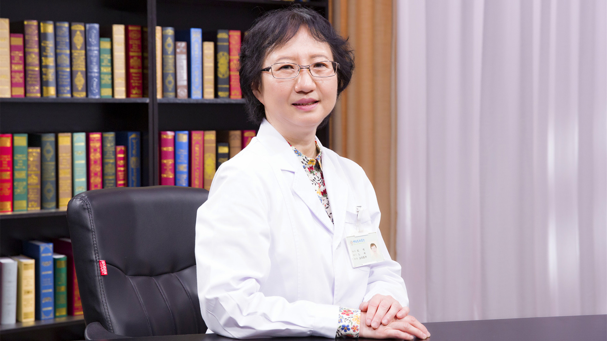

# 高苯丙氨酸血症

---

## 沈明 主任医师

中日友好医院儿科主任医师  硕士研究生导师 ；

北京市新生儿疾病筛查专家 ；朝阳区医疗事故鉴定委员会委员；《国际儿科学杂志》编委 ；《中华临床医学杂志》电子版编委 ；《中华儿科杂志》通讯编委 ；《中华医学遗传学杂志》通讯编委 。

**主要成就：** 2010年3月被北京市卫生局评为2009年“政府为百姓办实事”先进个人；发表论文60余篇，参编国内医学著作6部。

**专业特长** ：擅长在熟练处理儿科常见病和某些疑难病的基础上，侧重于遗传代谢病和小儿内分泌疾病的诊治，如软骨发育不全等遗传性侏儒和遗传性高苯丙氨酸血症（苯丙酮尿症PKU、四氢生物喋呤缺乏症），甲状腺功能低下，生长激素缺乏症（GHD）等生长障碍疾病。
