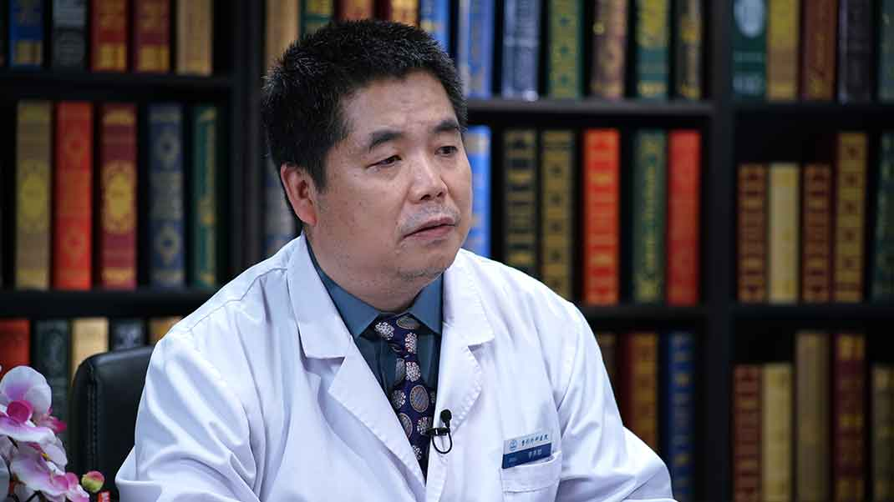

# 尿道下裂

---

## 李养群 主任医师

中国医学科学院整形外科医院 院南二病区主任 ；尿道下裂中心主任 主任医师 博士生导师

**主要成就：**在尿道下裂综合治疗及颊粘膜移植等项目中共参与取得4项成果；以第一作者及通信作者在专业期刊发表论文40余篇，参与发表论文130多篇，近五年发表文章29篇，其中SCI4篇。

**专业特长：**擅长先天畸形（尿道下裂、唇腭裂），体表肿瘤（色素痣、血管瘤、神经纤维瘤、淋巴管瘤、脂肪瘤）等疾病的治疗。

---
