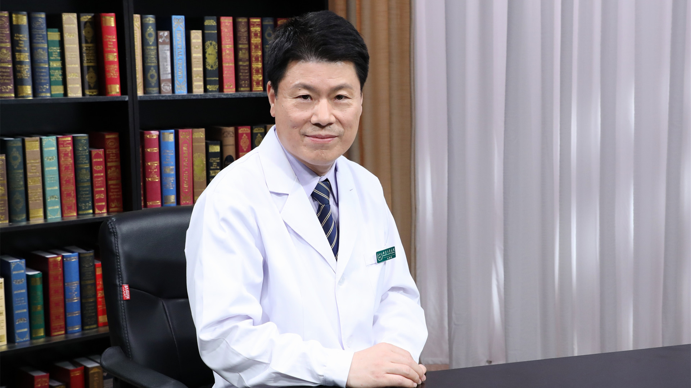

# 2.78 神经母细胞瘤

---

## 王焕民 主任医师

国家儿童医学中心、首都医科大学附属北京儿童医院肿瘤外科主任 主任医师 博士生导师；

中国研究型医院学会儿童肿瘤专业委员会主任委员；中华医学会小儿外科学分会委员及肿瘤学组组长；中国抗癌协会小儿肿瘤专业委员会候任主任委员；北京抗癌协会小儿肿瘤专业委员会主任委员；《中国小儿血液与肿瘤杂志》编委及编辑部主任。

**主要成就：** 发表研究论文数十篇，主持多项科研课题；曾参加美国St. Jude Children’s Research Hospital的International Outreach Program和Dana-Farber Cancer Institute/ Boston Children’s Hospital的Global Health Initiative等国际项目培训。

**专业特长：** 自参加工作以来一直从事小儿外科和小儿肿瘤的临床工作，积累了丰富的临床经验，擅长小儿普通外科疾病和小儿肿瘤的治疗。

---
