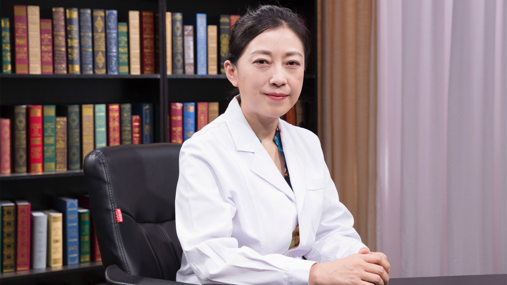

# 2.79 噬血细胞综合征//孙媛教授

---

## 孙媛 主任医师

北京京都儿童医院副院长 血液肿瘤中心主任 医学博士 主任医师；

中华医学会北京儿科分会委员；中华骨髓库北京分库专家委员会委员；北京医师协会儿内科专科医师分会理事；国际组织细胞协会委员；中国妇幼保健协会脐带血应用专业委员会副主任委员。

**主要成就：** 在国内外专业期刊发表相关学术论文10余篇；参与《组织细胞疾病》《儿童罕见病》等专业书籍的撰写；成立全国造血干细胞移植治疗噬血细胞综合征协作组、全国自体脐血移植治疗重型再生障碍性贫血协作组。

**专业特长：** 擅长造血干细胞移植治疗儿童各类血液病、免疫系统疾病诊断及治疗，尤其是对遗传代谢病、原发性免疫缺陷病、噬血细胞综合征、复发及难治性白血病、淋巴瘤、再生障碍性贫血等疾病的相关诊断及治疗，有多年的临床经验。

---
