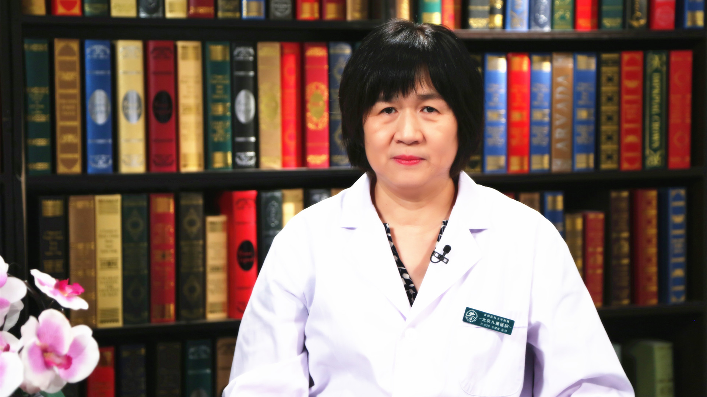

# 小儿麻醉

---

## 张建敏 主任医师

首都医科大学附属北京儿童医院麻醉科主任 主任医师 硕士生导师；

中华医学会麻醉学分会小儿学组副组长；中国心胸血管麻醉学会小儿麻醉分会副主任委员 ；中华医学会北京分会麻醉学专业委员会常务委员；中华医学会北京麻醉学分会心胸学组委员 ；北京医师协会麻醉专科医师分会常务理事；首都医科大学麻醉学系系务委员。

**主要成就：** 参编参译书籍14部，在国内外核心杂志发表文章63篇；主编《小儿手术麻醉典型病例精选》，在中国麻醉学指南与专家共识中负责撰写《新生儿和低体重新生儿麻醉指南》，并参与多部儿科麻醉指南的编写。

**专业特长：** 长期致力于儿科麻醉的临床和科研研究，擅长小儿各类手术的麻醉，特别是各种复杂先心病、腔镜手术以及危重患儿的麻醉，在脊柱侧弯麻醉和血液保护、儿童全麻深度监测和小儿麻醉安全等方面有丰富的临床经验和研究。

---
