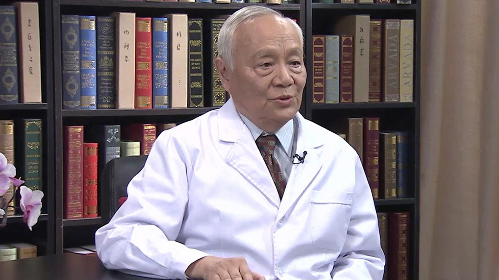

# 小儿脑瘫蕾波疗法

---

## 任世光 主任医师

首都医科大学附属北京友谊医院儿童健康中心顾问 教授；

曾任首都医科大学附属北京友谊医院微循环研究室主任；曾任北京市临床医学研究所副所长；中国优生优育协会儿童发育专业委员会副主任委员；北京康复医学会儿童脑瘫康复专业委员会副主任委员；中国康复研究中心儿童脑瘫康复国际合作中心客座教授；《中国康复理论与实践》杂志编委。

**主要成就：** 获北京市卫生科技先进个人奖；作为第一完成人获北京市科技进步三等奖2项；获北京市卫生局、北京市中医管理局科技成果1-2等奖4项；发表论文60余篇，参与专业著作4部。

**专业特长：**擅长婴儿脑损伤异常的早期认出、脑瘫的早期诊断；擅长婴幼儿脑损伤综合征、脑瘫的治疗；擅长中西医结合的蕾波康复法、蕾波推顺按摩及点穴在肌痉挛和肌萎缩相关疾病的应用。

---
