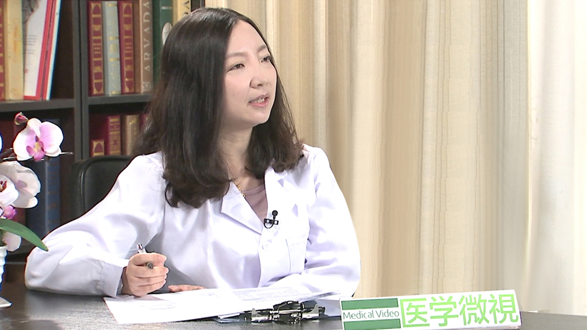

# 2.115 小儿遗尿

---

## 初梅 主任医师

首都儿科研究所附属儿童医院肾脏内科专业主任医师。

**主要成就：** 2007年由国际儿科肾脏病协会选派至韩国首尔国立大学儿童医院进一步深造儿童肾脏专业，并获得国际儿科肾脏病协会(IPNA) Fellow证书。 在国内医学专业核心期刊发表专业论文20余篇。对于肾病综合征、IgA肾病、过敏性紫癜、紫癜性肾炎、复杂性泌尿系感染、儿童遗尿症、急慢性肾衰等儿童肾脏疾病及常见的儿童呼吸道、消化道疾病，具有丰富的临床经验。

---
