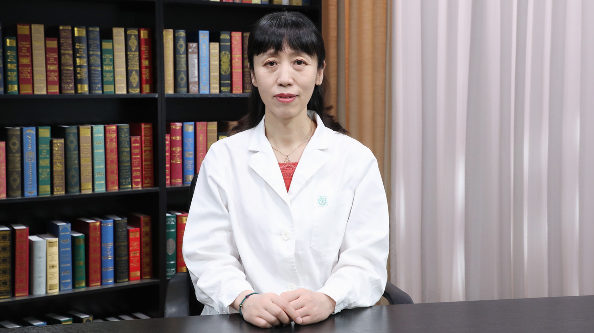

# 小儿支气管肺炎

---

## 袁艺 主任医师

首都儿科研究所附属儿童医院呼吸内科副主任 主任医师 副教授 硕士生导师 医学博士；

中华医学会儿科学分会呼吸学组疑难少见病协作组副组长；中华医学会儿科学分会呼吸学组全国儿童弥漫性实质性肺疾病/间质性肺疾病协作组委员；中国罕见病联盟呼吸病学分会委员；中国中药协会儿童健康与药物研究专业委员会委员；北京医学会儿科学分会呼吸学组委员；《中华实用儿科临床杂志》编委。

**主要成就：** 曾承担国家卫生计生委医药卫生科技发展研究中心项目、北京市优秀人才培养资助项目；参与首都医学发展科研基金项目及“十•五”攻关课题资助项目等；以第一作者/通讯作者在国内核心医学期刊发表论文多篇。

**专业特长：** 擅长儿童呼吸系统疾病的诊断及治疗，尤其擅长儿童呼吸道感染、慢性咳嗽、支气管哮喘等疾病的诊治。

---
