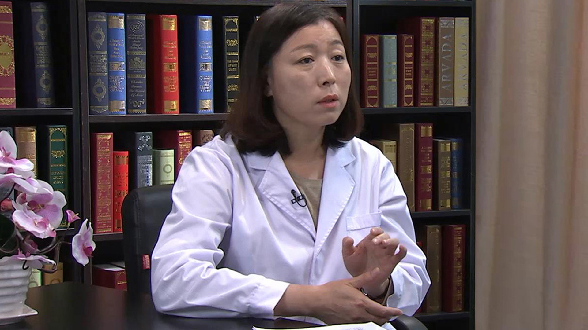

# 新生儿黄疸

---

## 李莉 主任医师

首都儿科研究所新生儿科主任 主任医师 硕士生导师；

中华医学会新生儿学组委员；中华医学会围产分会委员；中国医师学会新生儿专业委员会常委；北京医学会围产分会常委；北京医学会早产儿学会常委；北京市新生儿学组组长；《中华新生儿科杂志》编委；《北京医学》《中华尔科杂志》通讯编委。

**主要成就：** 在新生儿巨细胞病毒活动性感染的诊断，巨细胞病毒母婴垂直感染率的调查，新生儿色素失禁症管理，新生儿胆汁淤积症的管理等领域完成论著40余篇，参于撰写论著8部

**专业特长：** 擅长疑难重症新生儿疾病和常见小儿内科疾病的诊治，特别在新生儿感染、早产儿、黄疸、新生儿胆汁淤积症、出生缺陷等疾病方面进行了多项科学研究。

---
