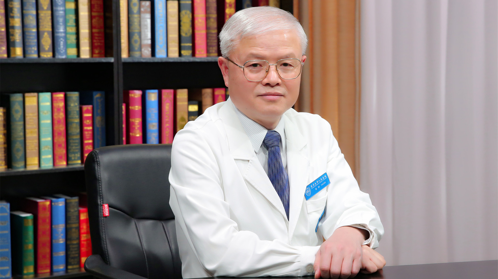

# 小儿精神发育迟滞（智力障碍）

---

## 秦炯 主任医师

北京大学人民医院儿科主任 主任医师 博士生导师；

中国抗癫痫协会副会长兼秘书长 ；中华医学会儿科学分会神经学组组长 ；中国医师协会神经调控专业委员会副主任委员 ；北京抗癫痫协会名誉会长 ；亚洲大洋洲儿科神经协会理事 ；国际抗癫痫联盟亚洲大洋洲地区委员会委员。

**主要成就：** 系统开展了儿童癫痫、各类脑病的临床和应用研究；主持相关国家和省部级科研项目数项，以第一完成人获省部级科技进步奖3项；指导毕业博士生30余名；发表论文200余篇；主持发布相关疾病临床诊疗管理专家共识10余项；主编或参编专著或教材多部。

**专业特长：** 一直在北京大学从事儿科学、儿科神经病学、癫痫病学及发育行为儿科学的临床诊疗、教学及研究工作。擅长癫痫、遗传性神经变性病、注意缺陷多动障碍及其它发育行为障碍的临床诊治。

---
