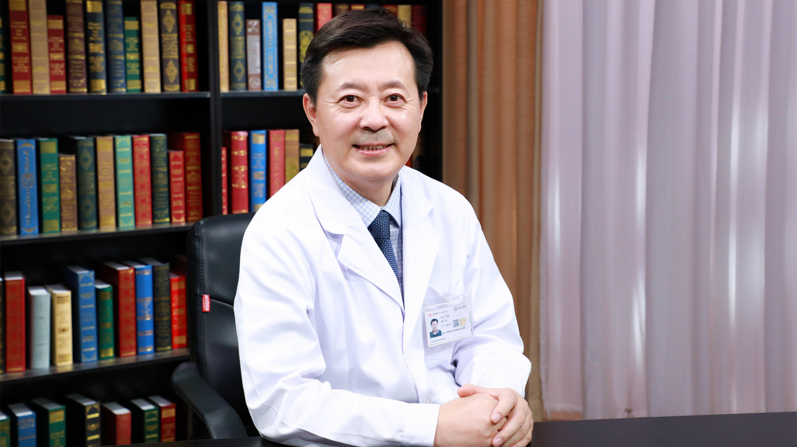

# 3.6 垂体腺瘤

---

## 于书卿 主任医师

首都医科大学附属北京天坛医院国际部神经外科综合医疗病区主任 主任医师 博士生导师；

中国医师协会脑胶质瘤专业委员会副主任委员；中华医学会医疗鉴定专家库专家；北京医师协会神经外科专科医师分会理事；北京医学会神经外科学分会委员；北京市继续医学教育委员会学科组专家。

**主要成就：** 主持国家自然科学基金项目、北京市教委、科委、中央和北京市保健局等科研课题研究；发表相关专业论文及SCI 50余篇，参编专著8部；获医学发明专利一项；获中华医学科技奖二等奖。

**专业特长：** 从事临床工作以来一直开展颅脑肿瘤的临床治疗与基础研究；擅长脑膜瘤、胶质瘤、垂体腺瘤、听神经瘤和各种先天性肿瘤（胆脂瘤等）的微创显微神经外科治疗。

---
