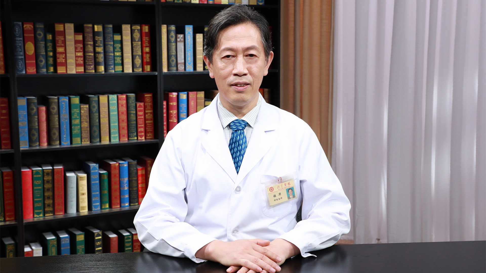

# 3.8 多发性硬化

---

## 张华 主任医师

北京医院神经内科神经免疫专业主诊专家 主任医师 硕士生导师；

北京神经科学学会神经免疫与相关疾病专业委员会主任委员；北京中西医结合学会神经内科专业委员会副主任委员；国际多发性硬化论坛委员会委员；中国卒中学会免疫分会常委；中国免疫学会神经免疫学分会委员。

**主要成就：** 参与完成了多项国家重点、国家级、部级及国际合作科研课题；书写论文100余篇（其中第一作者33篇）、论著6部；先后获得部级科研成果二等奖、三等奖各一次，局级奖多次；《中国神经免疫学和神经病学杂志》副主编。

**专业特长：** 擅长神经免疫学以及老年神经病的诊治，包括多发性硬化、重症肌无力、格林-巴利综合征、自身免疫性脑炎等神经免疫学相关疾病。

---
