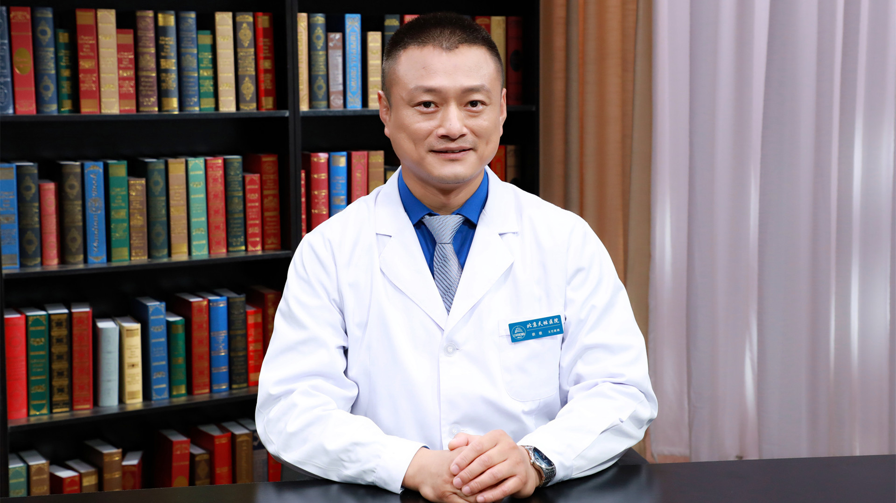

# 额颞叶变性

---

## 徐俊 主任医师

首都医科大学附属北京天坛医院神经病学中心主任医师 认知障碍学术带头人 博士生导师 ；

北京市青年拔尖团队带头人；中国老年医学学会认知障碍分会副会长；中国卒中学会脑健康分会副主任委员；中华医学会肠外肠内营养学分会脑健康营养协作组组长。

**主要成就：** 以第一或通讯作者发表SCI论文28篇，主持国家自然科学基金课题5项、部省级课题20项-累计经费1000余万；以第 1 完成人获授权发明专利 2 项，软件著作权 5 项；获省部级奖项4项；出版专著3部，参编/翻译专著6部。

**专业特长：** 主要从事认知障碍疾病临床诊治和发病机制研究。

---
