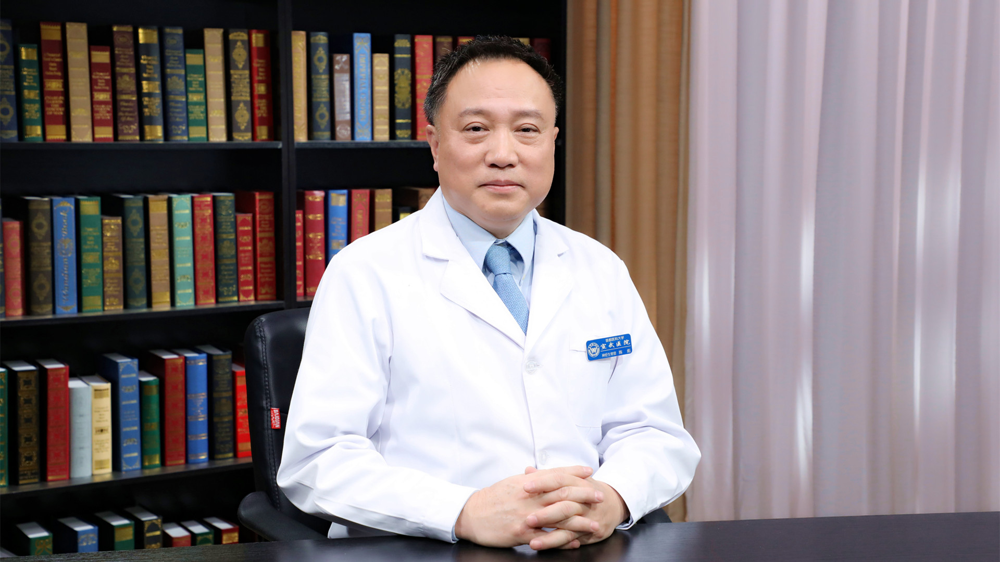

# 脊髓小脑性共济失调

---

## 陈彪 主任医师

首都医科大学宣武医院神经内科副主任 主任医师 老年医学部主任 博士生导师；

中国老年医学学会副会长；中华医学会老年医学分会第十届委员会副主任委员；中国医师协会老年医学分会副主任委员；中国老年学和老年医学学会老年脑疾病分会主任委员；北京医学会老年医学分会主任委员；北京脑重大研究院帕金森病研究所所长；国家老年疾病临床医学研究中心主任。

**主要成就：** 入选“新世纪百千万人才工程”国家级人选、教育部“长江学者和创新团队发展计划”首席科学家、“万人计划”百千万工程领军人才、北京市卫生系统高层次卫生技术领军人才、“科技北京”百名领军人才和北京市医院管理局“使命人才”；作为负责人承担国家自然科学基金重点项目、863项目、重大新药创制计划、973子课题、科技部支撑计划和行业基金等30余项科研课题，并获多项美国福克斯（MJFOX）基金会资助课题；共发表SCI文章250余篇，他引总次数逾7500次，发表统计源期刊论文340余篇，他引总次数逾3600次，谷歌H指数44；授权牵头和参与发明专利15个，4个已转让；先后带领团队获得2015年北京市科学技术奖一等奖，2016年中华医学科技奖二等奖。

**专业特长：** 擅长帕金森病、老年性痴呆等神经退行性疾病的基础、临床及转化医学研究；开设帕金森病专病门诊，诊治病人数万人次，通过网络医疗、远程医疗、可穿戴设备等新技术手段对帕金森病患者进行早期诊断和疾病的全程管理。

---
