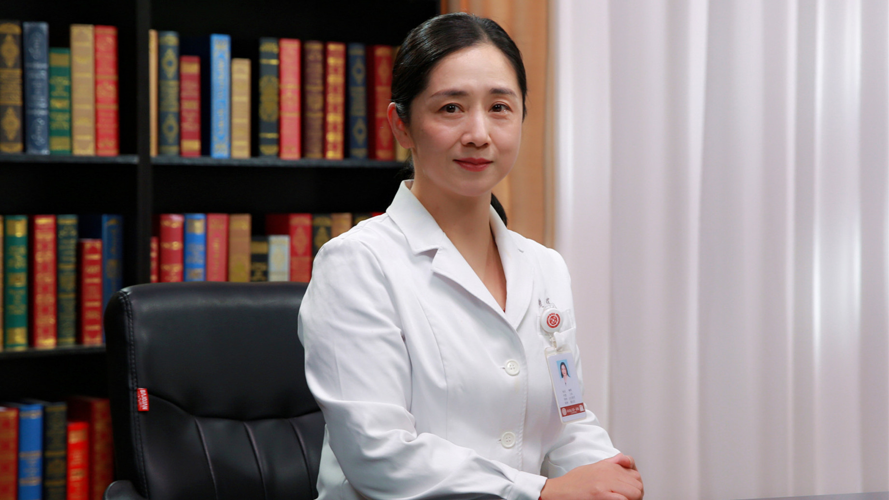

脊髓性肌萎缩症

# 脊髓性肌萎缩症

---

## 熊晖 主任医师

北京大学第一医院儿科副主任 主任医师 博士生导师；

中华医学会儿科学分会青年委员会副主委兼内分泌遗传代谢学组委员和医院管理委员会委员；北京医学会罕见病分会常委兼儿童神经肌肉病学组组长；北京医学会遗传学分会委员；亚洲大洋洲肌病中心理事；《儿科药学杂志》《中华儿科杂志》《中华实用儿科临床杂志》编委或通讯编委。

**主要成就：** 承担多项研究课题，包括国家自然科学基金、北京市自然科学基金等，以第一完成人获第二届(2017年)中国妇幼健康科学技术奖科技成果奖一等奖；
以第一或责任作者发表学术论文70余篇,其中SCI文章18篇，参与了多部书籍的编写工作。

**专业特长：** 擅长于儿童神经系统疾病、神经遗传病、神经肌肉病的诊断、治疗和规范化管理。尤其对遗传性神经肌肉病、先天性肌营养不良有深入的研究。

---
