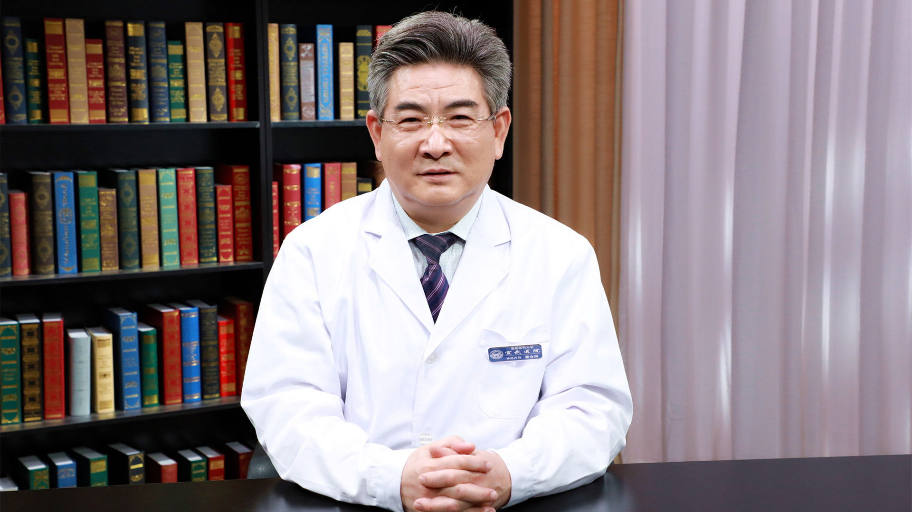

# 3.32 急性播散性脑脊髓炎

---

## 董会卿 主任医师

首都医科大学宣武医院神经内科免疫疾病专业组长 主任医师 硕士研究生导师。

中华医学会神经病学分会神经免疫学组副组长；中国免疫学会神经免疫分会副主任委员；中国医师协会神经病学分会神经免疫专业委员会副主任委员；中国卒中学会卒中免疫专家委员会副主任委员；《中国神经免疫学和神经病学杂志》副主编。

**主要成就：** 发表中国科技论文统计源期刊论文90余篇，SCI6篇；曾经承担的课题有卫生部“九五”攻关《老年性痴呆早期临床诊断》课题，目前承担的研究课题为北京市教育委员会科技发展计划面上项目《自体造血干细胞移植治疗多发性硬化长期临床疗效及影像学研究》，北京市科委首都市民健康培育项目《T细胞受体Vβ链结构测定对多发性硬化症的诊断》等。

**专业特长：** 擅长神经系统炎症和免疫性疾病（如脑炎、脱髓鞘病、急慢性炎性神经根神经病、认知障碍疾病等）的诊治。

---
