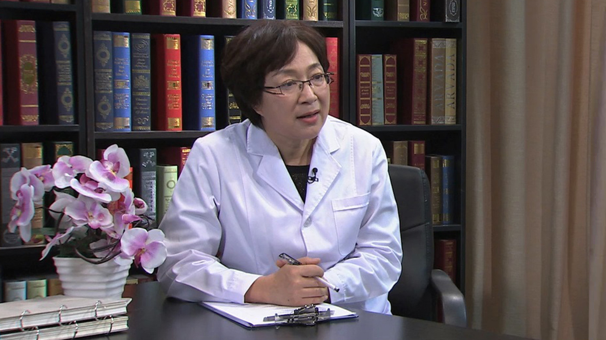

# 肌张力障碍

---

## 万新华 主任医师

中国医学科学院北京协和医院神经内科主任医师 博士生导师 教授；

中华医学会神经科分会帕金森及运动障碍病学组委员；中华医学会老年医学分会神经病学专业学组委员；中国医师协会神经调控专业学组委员；《中华神经科杂志》编委

**主要成就：** 主持完成《A型肉毒毒素在神经科的治疗应用》的课题，获得北京协和医院2004年医疗成果奖；参与完成的《单纤维肌电图技术在运动神经疾病、神经肌肉接头病和肌肉病中的应用和规范化诊断方法的建立》获得2007年中华医学科技二等奖；参与编写学术专著10余部。

**专业特长：** 长期从事神经病学的临床、教学及科研工作，专长于运动障碍病（锥体外系疾病）的诊断和治疗，对以运动异常为突出表现的少见、疑难杂症有着丰富的临床经验。对肉毒毒素的临床应用研究在国内处于领先水平。

---
