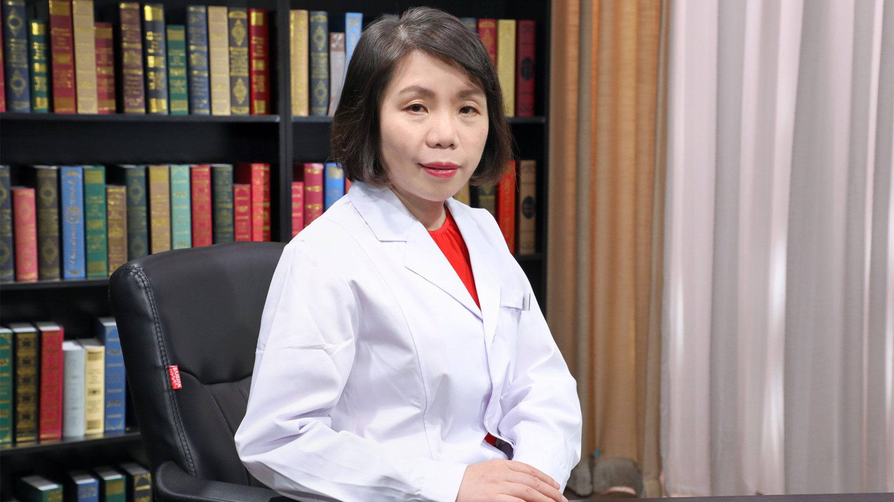

# 老年人认知障碍

---

## 王华丽 教授

北京大学第六医院记忆障碍诊疗与研究中心执行主任 临床研究室主任 教授；

北京市痴呆诊治转化医学研究重点实验室副主任；中国老年保健协会阿尔茨海默病分会（ADC）常务副主任委员；中国老年学和老年医学学会老年心理专业委员会副主任委员；中国老年医学学会精神医学和心理健康分会副会长；世界痴呆理事会（WDC） 常务理事；国际阿尔茨海默病协会（ADI）常务理事；环太平洋地区精神病学学会（PRCP）常务理事。

**主要成就：** 担任世界卫生组织（WHO）全球痴呆监测顾问，参与编写世界卫生组织（WHO）全球痴呆研究重点报告、痴呆和认知衰退风险防控指南等，主持的痴呆社区管理项目成果被世界卫生组织（WHO）西太区采纳，并入选北京市科学技术委员会2018 年《科技筑梦 健康未来》“首特专项”视频宣传；2000年创办国内首家AD医患家属联谊会，开创我国特色痴呆照护辅导技术，提出认知障碍全程管理理念；作为项目及课题负责人以及课题主要骨干，共承担痴呆相关的国家科技部、国家自然科学基金委员会、国家卫生健康委员会、北京市科学技术委员会、北京市卫生健康委员会、世界卫生组织（WHO）、美国NIH、美国阿尔茨海默病协会、英国医学科学院等资助的科研项目50余项，主编、副主编、参编、主译国内外专著10余部，发表SCI论文及中文核心期刊论文百余篇，参与全球痴呆研究重点领域遴选工作，研究工作发表于《柳叶刀-神经病学》杂志；曾担任CCTV“我的父亲母亲”新闻公益行动指导专家、“中英（青岛）社区失智者照护体系建设试点项目”首席专家。

**专业特长：** 擅长老年情绪与认知障碍诊疗与全程管理、老年心理咨询；20余年致力于老年情绪与认知障碍的诊疗、研究和照护辅导工作，成果卓著，尤其具有极为丰富的记忆门诊管理经验，并建立了老年认知障碍临床病例登记系统。

---
