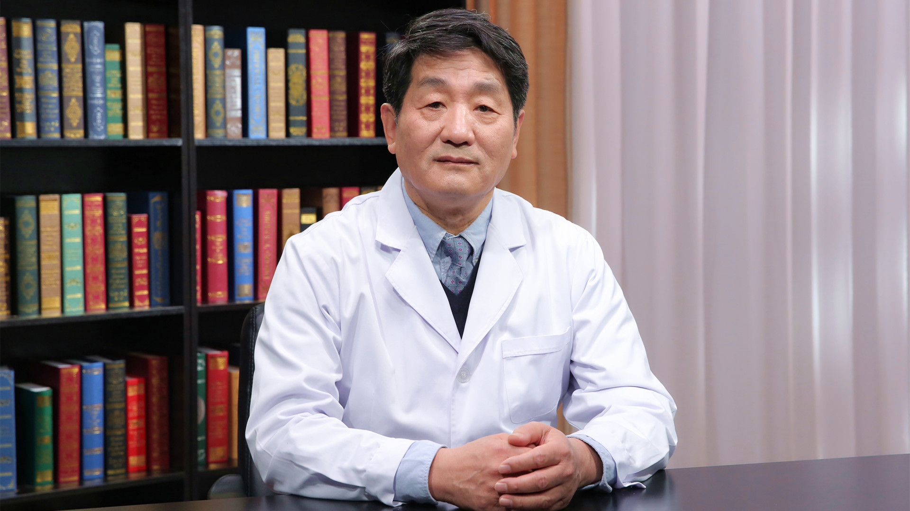

# 3.37 颅骨成形（修补）术

---

## 富壮 主任医师

曾任北京天坛医院外伤病区主任 主任医师；

中国非公立医疗机构协会神经外科专业委员会常委；曾任中国医师协会神经外科医师分会委员；曾任中华医学会神经外科学分会委员；曾任北京医学会神经外科学分会常委；曾任北京神经科学学会理事；

曾任北京医师协会神经外科专家委员会委员。

**学术成就：** 从事神经外科40余年，曾任北京天坛医院神经外科颅脑创伤病房主任，于2002年调至北京积水潭医院创建神经外科；得益于国内诸多老一辈神经外科知名专家言传身教，积累大量的临床经验，并培养一批年轻医生；2012年荣获“中国名医百强榜”上榜医生；担任国内多家专业杂志编审、参编多种专业书籍及学术论文。

**专业特长：** 擅长神经外科各种疾病诊疗，尤其擅长颅脑损伤、脊髓损伤及修复治疗。

---
