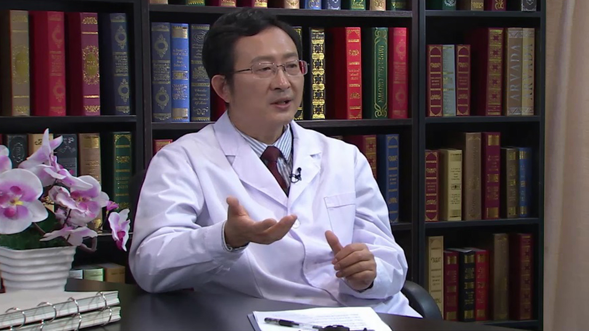

# 路易体痴呆

---

## 肖卫忠 主任医师

北京大学第三医院神经科 主任医师 研究生导师 中央党校院区院长；

中国老年痴呆及相关疾病专业委员会（ADC）常务委员；中国老年医学学会认知障碍分会(ACDC)常务委员；中国老年学学会老年医学专业委员会认知障碍专家委员会委员；中国老年保健医学研究会老年认知与心理学会常务委员；中华医学会北京分会神经病学分会北京帕金森病与运动障碍学组委员；北京神经内科学会（BNA）监事长；北京神经内科学会认知障碍及相关疾病专业委员会（BNA-CIRD）主任委员。

**主要成就：** 曾获北京市教育创新标兵称号；参与国家重点研发计划“重大慢性非传染性疾病防控研究”重点专项项目“阿尔采默病”等课题；承担北京大学“211工程”循证医学课题；发表国内外文献50余篇。

**专业特长：** 擅长认知障碍与痴呆、帕金森病、脑血管病、脱髓鞘疾病等神经系统疾病的诊治及其临床流行病学与循证医学的研究等。

---
