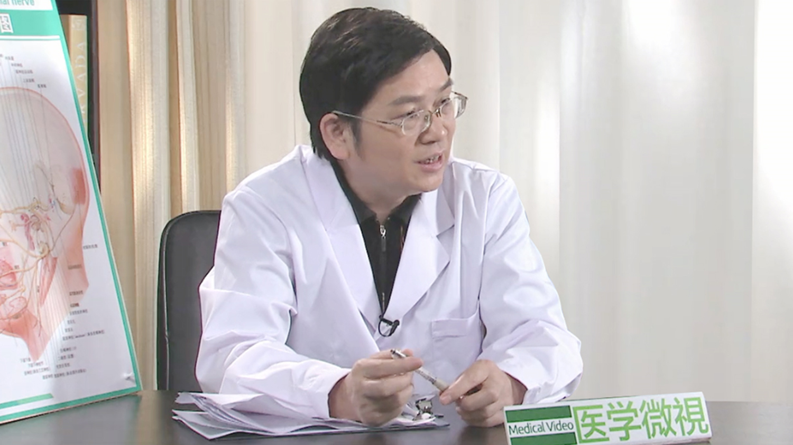

# 面肌痉挛

---

## 陈国强 主任医师

中国医科大学航空总医院党委副书记 神经外科中心主任兼首席专家 主任医师 教授 博士后导师；

世界疼痛医师协会中国分会副会长；中航医疗神经外科专业委员会主任委员；中国微循环学会神经变性疾病专业委员会常务委员；中国医师协会神经外科分会内镜专业委员会委员；卫计委内镜考评委员会专家；中华中青年神经外科交流协会常委；中国内镜医师协会委员；中国抗癫痫协会第一届理事；国内多个杂志编委及审稿专家。

**主要成就：** 脑室内镜手术开创了多项世界先进、国内领先项目；国际首创神经内镜下钻孔冲洗术治疗慢性硬膜下血肿（术后不放置引流）；在国内最早开展立体定向微创显微切除脑功能区及脑深部病灶，发明了具有自主知识产权的多功能立体定向手术系统；先后承担国家自然科学基金、首发基金、清华裕园基金、人事部归国人员科研基金、卫生部科研专项等多项基金，有四项专利发明；在国内外专业杂志发表论文80余篇，其中SCI论文10余篇；2007年获中国内镜医师协会颁发“恩德思”医学科学技术奖——“杰出成就奖”；2015年获科学中国人2014年度人物奖。

**专业特长：** 擅长微血管减压术治疗面肌痉挛、三叉神经痛、舌咽-迷走神经痛及其它各种颅神经疾病；软性/硬性神经内镜治疗各种脑室内疾病；各种颅内脊髓肿瘤等。

---
