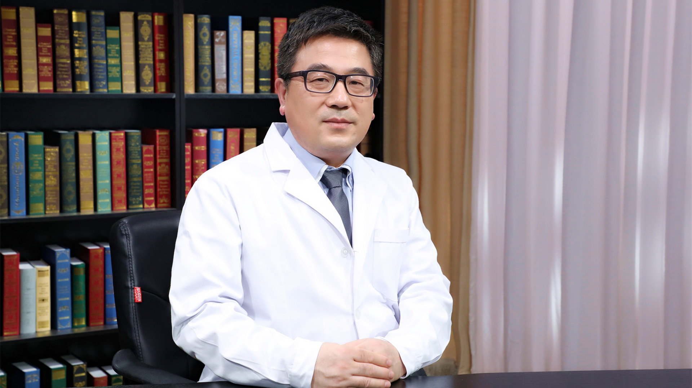

# 脑胶质瘤术中放化疗

---

## 韩小弟 主任医师

首都医科大学附属北京天坛医院神经外科主任医师；

曾任北京天坛普华医院副院长 神经外科主任；中国医疗保健国际交流促进会神经损伤学分会常务委员 ；北京医学会放射肿瘤学分会泛京津冀术中放疗协作组常务委员；北京医学会神经外科学分会委员；北京医师协会神经外科医师分会理事。

**主要成就：** 参与北京市许多重大课题的研究和神经外科教材和书籍的编写和翻译工作；2001年获北京市科学技术二等奖“颅内巨大动脉瘤、巨大脑血管畸形外科治疗的深入研究”；2005年获北京市科学技术一等奖“微创神经外科技术平台的建立及临床应用”（H01-2004-041）。

**专业特长：** 擅长神经外科各类疾病的外科治疗和综合治疗，以脑肿瘤的手术、术中放化疗和术后的综合靶向治疗和化疗为主。同时开展脊髓损伤的手术和修复以及康复综合治疗、脑血管疾病（动脉瘤、血管畸形等）的手术和复合手术、脑外伤的神经修复等。在国内较早提出“胶质瘤术后综合治疗”这种观点，最早在国内开展和引进胶质瘤的综合治疗基础上的NCCN标准治疗、靶向治疗、电场治疗、术中放疗、术中化疗和免疫治疗以及分子生物学基础上的精准治疗。

---
