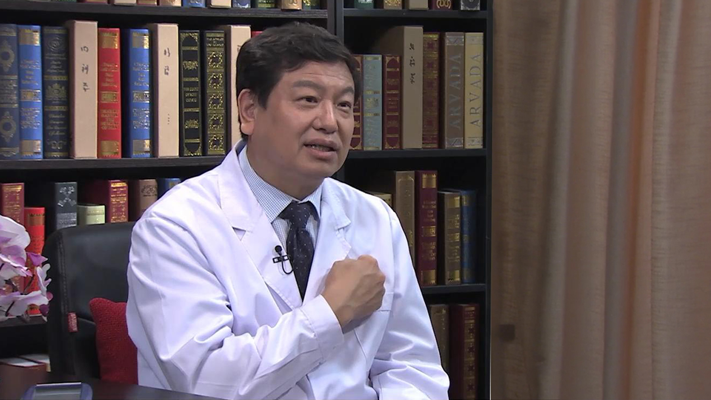

# 脑起搏器//张建国教授

---

## 张建国 主任医师

首都医科大学附属北京天坛医院功能神经外科主任；

北京市神经外科研究所功能神经外科研究室主任；神经电刺激研究与治疗北京市重点实验室主任；神经调控技术国家工程实验室副主任；癫痫临床医学北京市重点实验室副主任；中华医学会神经外科分会功能神经外科学组主任委员；中国医师协会神经调控专业委员会副主任委员；亚洲癫痫外科协会及中国抗癫痫协会常务理事。

**主要成就：** 2006年获北京市科学技术奖一等奖；2009年获北京市科技进步二等奖；2011年获中华医学科技三等奖；2015年获教育部科技进步奖二等奖。

**专业特长：** 擅长神经调控治疗各类脑功能性疾病，开展我国第一例脑深部电刺激（DBS）治疗帕金森病，手术整体数量和质量居国内领先水平；制定并完善了癫痫诊断、治疗的详细规范化流程；带领团队与清华大学航空航天学院合作，致力于DBS、VNS的国产化设备研发与推广。

---
