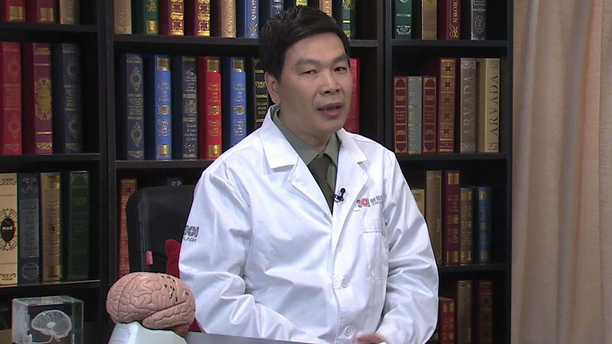

# 3.51 脑起搏器//凌至培教授

---

## 凌至培 主任医师

中国人民解放军总医院神经外科主任医师；中国人民解放军总医院功能性神经外科专业负责人；中华医学会神经外科分会功能学组委员；中国医师协会神经调控委员会常委；中国医师协会神经外科分会功能神经外科专业委员会委员。

 **主要成就：** 1998年8月在国内率先开展DBS（脑起搏器）手术治疗帕金森病和MR导向立体定向毁损治疗难治性精神病，该项目填补了国内空白；2010年在国内首先应用多通道微电极记录与微刺激技术进行电生理靶点定位，提高了手术的疗效。目前已经规范化并向全国推广；近年来主持或参加国家级和省市级科研课题4项，发表学术论文20余篇。

 **专业特长：** 从事神经外科临床工作31年，擅长神经外科常见疾病的治疗。尤其在帕金森病、顽固性疼痛、药物难治性癫痫和难治性精神病、三叉神经痛及面肌痉挛等功能性疾病的微创手术方面有独到之处。

---
