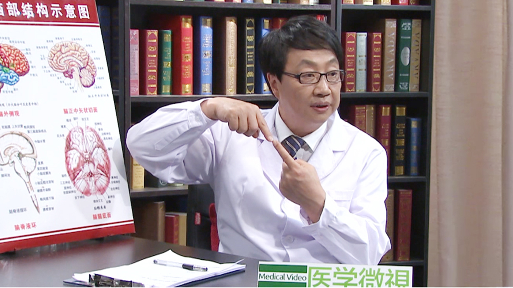

# 脑瘫

---

## 王世杰 主任医师

清华大学玉泉医院神经外科主任 主任医师 医学博士； 

郑州大学医学院，辽宁省人民医院，聊城市脑科医院等多所医院特聘教授；中华中青年神经外科协会周围神经外科论坛主席；北京医学会神经外科分会学术委员会委员；日本厚生省（卫计委）特许临床研究员。

**主要成就：** 编著面肌痉挛显微神经血管减压术中诱发肌电图监测的意义（中华神经外科杂志，2006） 儿童痉挛型脑瘫的神经外科治疗（中华神经外科杂志，2008） 表面肌电图在脑瘫手术中的应用（中华神经外科杂志，2014） 颈动脉外膜交感神经剥离术治疗重症脑瘫的疗效观察（中国康复理论与实践，2008） 遗传性痉挛性截瘫的神经外科治疗（立体定向和功能神经外科，2011） 神经导管联合人雪旺细胞修复大鼠外周神经损伤的研究（神经损伤与功能重建，2015）。

**专业特长：** 擅长颅神经疾病，周围神经疾病。

---
