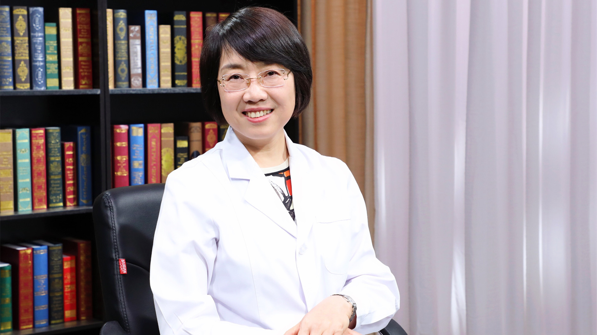

# 脑外伤的康复治疗

---

## 张皓 主任医师

中国康复研究中心北京博爱医院神经康复三科主任 主任医师 博士生导师；

中国残疾人康复协会神经康复专业委员会主任委员；中国国际医疗保健促进协会神经康复专业委员会主任委员；中华医学会物理医学与康复专业委员会神经康复学组副组长；中国康复医学会重症康复专业委员会第一届委员会副主任委员。

**主要成就：** 主持并参与了国家重点研发计划、国家自然科学基金、首都临床特色应用研究、首发基金、财政部专项基金等多项课题的研究工作；主编《神经康复学》等医学专著。

**专业特长：** 擅长脑卒中与脑外伤等神经系统疾病的康复。

---
