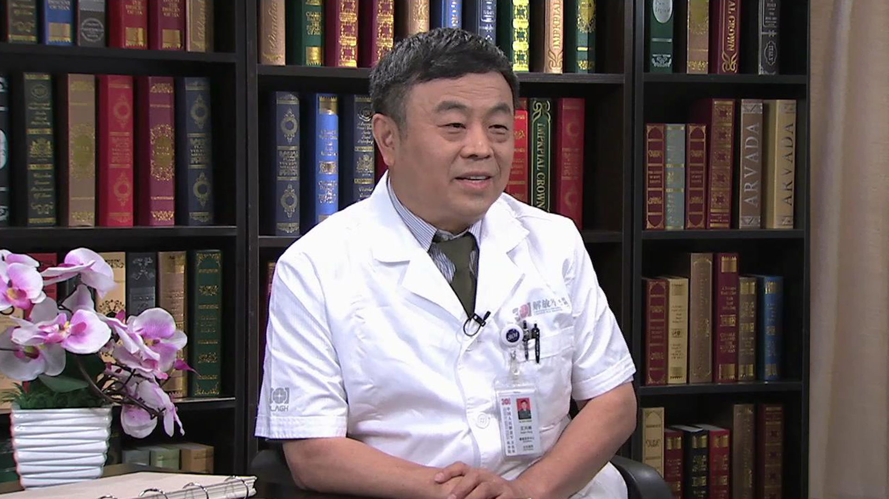

# 3.61 脑卒中康复治疗

---

## 王兴林 主任医师

中国人民解放军总医院（301医院）康复医学中心主任医师 博士生导师；

中华物理医学与康复学会北京分会副主任委员；中华物理医学与康复委员会常务委员；全国康复专业技术委员会副主任委员；国家FDA医疗器械审评专家。

**主要成就：** 第一完成人获军队医疗成果二等奖1项、医疗成果三等奖2项、科技进步三等奖2项；获国家发明专利授权2项、实用新型专利2项；主编《面神经麻痹》《瘫痪病专家门诊110问》，参与编写专著多项，发表论著50余篇，SCI收录5篇。

**专业特长：** 擅长面瘫、偏瘫、吞咽障碍、周围神经损伤与病变及关节运动障碍的诊治，并对其有深入研究及独到见解，发明了NMR型神经肌肉康复仪。

---
