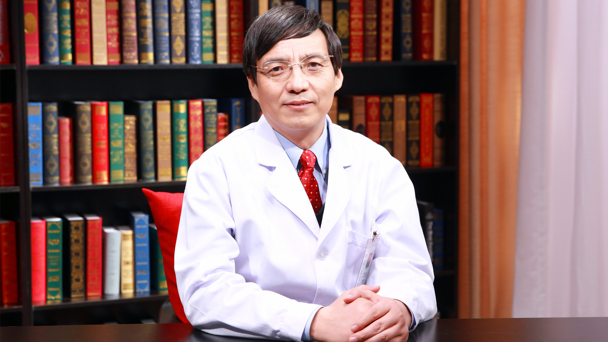

# 3.69 偏头痛

---

## 于生元 主任医师

中国人民解放军总医院神经内科主任 主任医师 博士生导师；

中华医学会疼痛学分会主任委员；中国医师协会神经内科医师分会副会长；北京脑血管病防治协会副会长；国际头痛学会（IHS）理事；国际头痛学会中国分会主席。

**主要成就:** 中国人民解放军总医院百项优势培育对象；国外期刊已发表于生元为第一作者或通讯作者的SCI文章90多篇；《中国疼痛医学》杂志副主编、中华医学会《健康世界》等刊编委；曾获得全军科技进步二等奖1项，多次获得中国疼痛医学会优秀论文奖。

**专业特长:** 擅长各种神经系统疾病，以及头面痛、脑血管病、认知功能障碍的诊治，专注神经影像学的临床研究。

---
