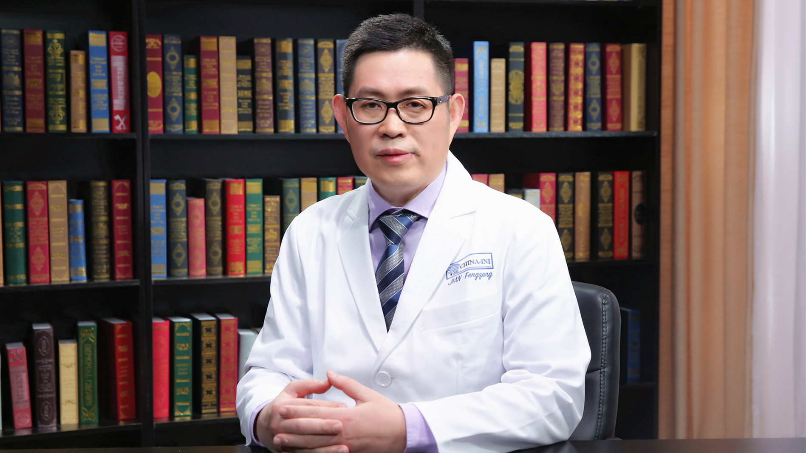

# 神经根型颈椎病

---

## 菅凤增 主任医师

首都医科大学宣武医院神经外科副主任 主任医师 博士生导师；

中华医学会神经外科分会脊柱脊髓学组副组长；第三、四届中国医师协会神经外科分会脊柱脊髓专家委员会主任委员 ；中国医促会骨科分会脊柱内镜专业委员会副主任委员；亚太颈椎学会执行委员；世界神经外科联合会脊柱专委会国际委员。

**主要成就：** 2011年在国内发起了全国脊柱神经外科大会； 2013年发起成立“神经脊柱讲师团”，对全国脊柱神经外科的发展起到了积极的推动作用；2017发起全国脊柱显微外科大会；从2006年起举办的近30期脊柱操作学习班，对中国大陆地区脊柱显微外科技术的推广产生了积极影响。

**专业特长：** 在国际上率先报告了直接后路复位固定技术治疗颅底凹陷合并的寰枢椎脱位，并获得多项国家专利；在国内首次报告显微镜下后路椎间孔扩大技术治疗颈椎病，显微镜下一侧入路双层减压治疗腰椎管狭窄等技术，不需固定，并保留脊柱相应节段的活动。

---
