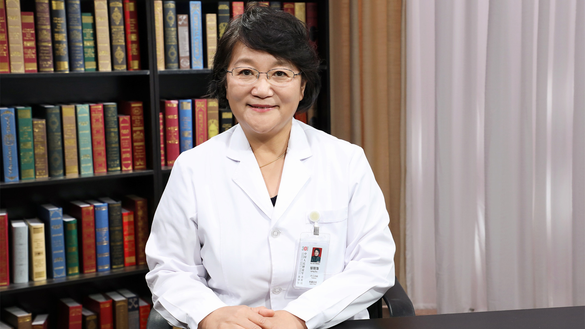

# 神经纤维瘤

---

## 邹丽萍 主任医师

中国人民解放军总医院第一中心儿内科主任 主任医师 博士生导师；

中国人民解放军总医院儿童医学中心主任；中国妇幼保健协会儿科疾病与保健分会副会长；中华医学会儿科学分会常委；北京医师协会儿科分会副会长；北京神经科学学会副理事长。

**主要成就：** 发表论文300余篇，发表SCI论文95篇；第一完成人获中华医学科技成果二等奖和三等奖，军队医疗成果二等奖两次，宋庆龄儿科医疗成果奖；获 973，国家自然基金等国家级和省部级项目20余项。

**专业特长：** 擅长儿童疑难杂症的诊治，特别是治疗各种儿童发育及儿童神经系统疾病，如癫痫、遗传代谢疾病、结节性硬化、神经系统脱髓鞘疾病、学习困难、心理行为异常等。

---
