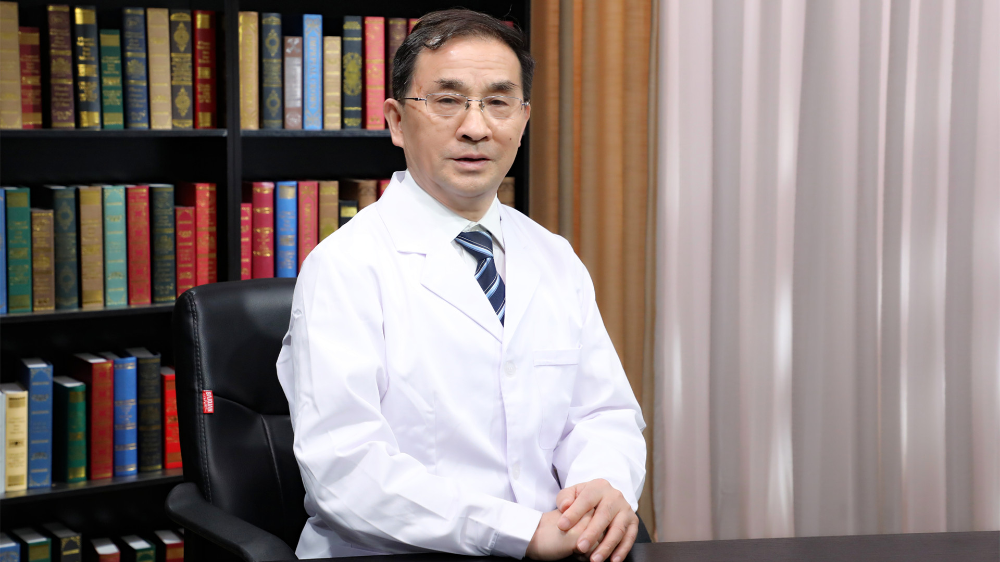

# 3.89 失眠

---

## 汪卫东 主任医师

中国中医科学院广安门医院心理科主任医师 原副院长 博士生导师；

北京广安睡眠科学研究院创办人 首席专家；享受国务院政府特殊津贴专家；中国中医科学院首席研究员；中国睡眠研究会副理事长；中国医师协会睡眠研究会常务理事；世界中医药学会联合会睡眠医学专业委员会名誉会长。

**主要成就：** 总结了具有中华文化和中医特色、又适合中国人心理疾病特点的中医系统心理疗法（SPT），逐渐建立了中医心理疗法的系统理论、方法与技术体系；把中医的思维、气功技术与催眠、精神分析、认知疗法进行有机的整合并有所创新，经过长期临床实践与积累，形成了“低阻抗意念导入疗法（TIP技术体系）”；在国内外杂志或著名国际大会上以第一作者和通讯作者名义发表论文近200篇，带领医疗队成员完成科研论文40多篇，编辑出版论文集一本，主编《传染性非典型肺炎的中西医结合治疗》一本，论文《103例恢复期SARS患者SCL-90因子特征分析》获《中国行为医学科学杂志》2003年度一等奖。

**专业特长：** 从事中医心理学及中医睡眠医学基础与临床等相关工作，擅长运用中医、中医心理TIP技术与非药物疗法治疗睡眠障碍、抑郁、焦虑、强迫、恐惧等心理疾病以及重性精神疾病的临床康复研究。

---
