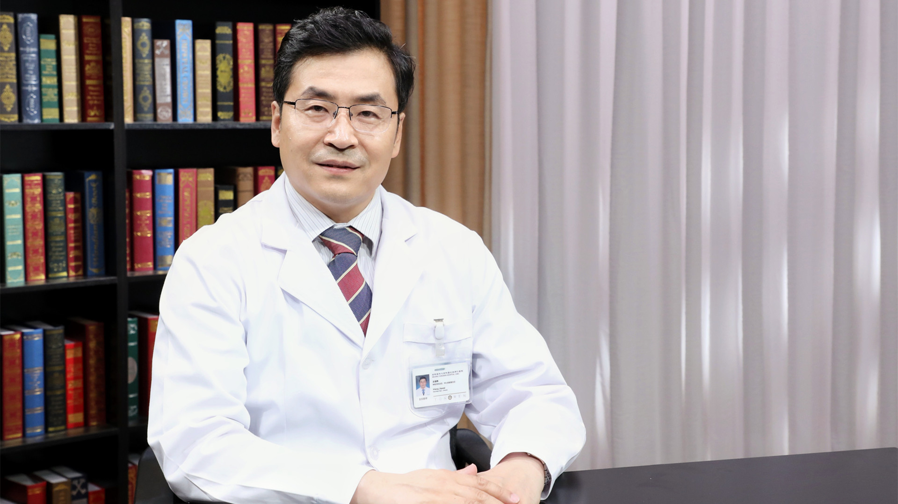

# 视神经脊髓炎

---

## 王佳伟 主任医师

首都医科大学附属北京同仁医院神经内科主任兼医院中心实验室主任 主任医师 医学博士 博士生导师；

中华医学会神经科分会神经感染和脑脊液细胞学组副组长；中华医学会神经科分会委员；中国医师协会神经内科分会委员；中国医师协会神经内科分会神经感染性疾病专委会副主任委员；北京医学会神经病学分会副主任委员；北京医学会神经内科分会神经感染学组组长 神经免疫学组副组长。

**主要成就：** 曾在《自然医学杂志》发表论著文章；相关研究获：国家科技部重点攻关项目、国家自然基金、北京市自然基金、首发重点攻关项目、首都特色等基金支持。

**专业特长：** 擅长自身免疫性脑炎、视神经脊髓炎、脑血管病、重症肌无力、多发性硬化、头晕、头痛等的诊治研究。

---
