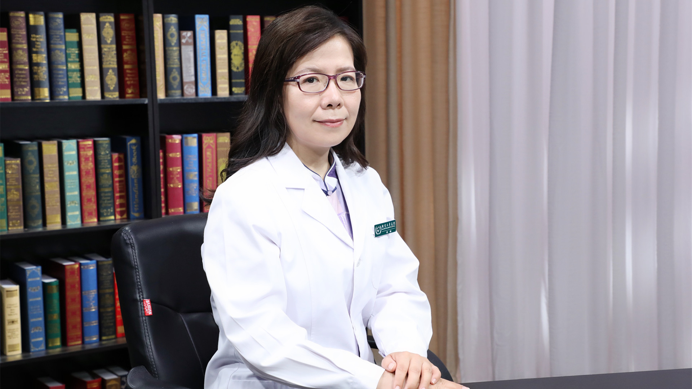

# 细菌性脑膜炎

---

## 刘钢 主任医师

首都医科大学附属北京儿童医院感染内科主任 主任医师 博士生导师；

中国医师协会儿童感染专业委员会副主任委员；中国医师协会循证医学专业委员会儿科学组副主任委员；中华医学会儿童感染和肝病学组副组长；亚太儿科感染性疾病专家委员会常务委员；北京预防医学会常务委员。

**主要成就：** 已发表文章百余篇，作为副主编完成《儿科感染性疾病诊疗规范》等著作；主持国家自然科学基金、国际合作项目等，入选北京市卫生人才百人计划、高层次人才儿科学学科骨干等。

**专业特长：** 在儿童血流与中枢神经系统感染早期诊断与防治、抗菌药物合理应用等方面开展临床与基础研究；擅长各类儿童感染性疾病的诊断与鉴别，对各种耐药病原体引起的复杂重症中枢神经系统感染诊治管理经验丰富；擅长发热待查、免疫缺陷合并感染及各类难治性复杂、混合感染等诊治管理。

---
