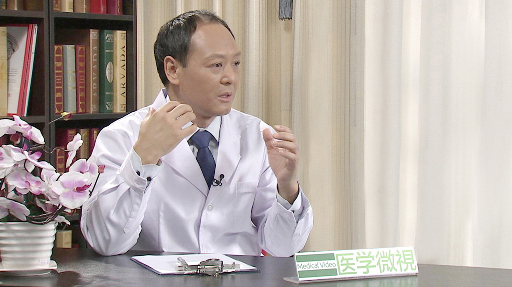

# 烟雾病

---

## 韩宏彦 主任医师

中国医科大学航空总医院神经外一科主任；

中国科学院北京转化医学研究院烟雾病研究室主任 主任医师；中国医师协会神经修复专业委员会委员；中华中青年神经外科交流协会委员；中华医学会北京分会神经外科专业委员会委员。

****主要成就：**** 多次参加国际性学术会议，发表学术论文近30篇，其中SCI(科学引文索引)收录期刊5篇。

**专业特长：** 擅长烟雾病，癫痫，脑瘤、脊髓肿瘤，脑积水、颅骨修补等，新型联合血管搭桥手术治疗烟雾病、手术治疗药物难治性癫、微创手术切除颅内肿瘤、显微血管减压术(MVD)治疗面肌痉挛、三叉神经痛。2015年世界神经外科大会在意大利罗马召开，韩宏彦教授应邀作为脑血管病一节的会议主席，并发表“新型联合血管旁路手术治疗烟雾病”主题演讲，受到来自世界各地神经外科专家的高度评价。

---
