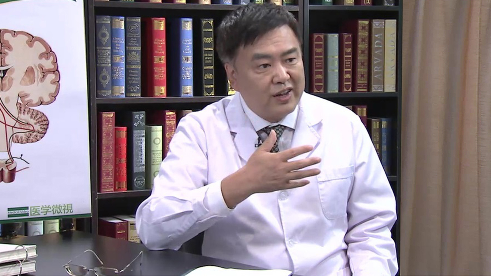

# 腰椎术后顽固性疼痛

---

## 王劲 主任医师

清华大学附属北京清华长庚医院副院长 主任医师 ；

首都医科大学附属北京天坛医院神经外科特聘海外专家；清华大学临床神经科学研究院副院长；美国神经外科双协会会员 （AANS & CNS）；北京医师协会神经外科专科医师分会委员。

**主要成就：** 1986年获世界卫生组织北京地区选拔考试第一名；1995年和1998年两度获得优秀住院医师奖；2003年成为改革开放后第一位取得美国神经外科协会认证的中国神经外科医师。

**专业特长：** 擅长治疗各种脑和脊髓脊柱病变，微创治疗脑肿瘤、胶质瘤，肿瘤立体定向手术活检，微创损毁手术，脑肿瘤的基因病理诊断，脑深部电极治疗巴金森氏病、震颤、肌张力障碍疾病、癫痫、疼痛、Touretee's综合征、抑郁症；擅长微创脊柱手术，复杂脊柱变性疾病的手术减压/固定，脊髓肿瘤的手术/综合治疗，环枕畸形/Chiari畸形，脊髓刺激器/药物泵。

---
