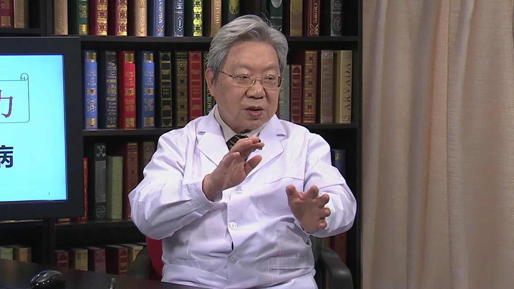

# 3.106 重症肌无力

---

## 许贤豪 主任医师

原北京医院神经内科专家 主任医师 博士生导师；

泛亚多发性硬化治疗和研究委员会多届常委；曾任国际神经免疫学会多届常务理事；国际多发性硬化联盟 医学咨询委员会多届委员。

**主要成就：** 完成国家自然基金和卫生部基金各6项；美国基金2项；国家九五和卫生部十五攻关课题各1项；北京自然基金、九七三、国计委和回国人员启动基金各1项；已发表论文426篇。

**专业特长：** 擅长临床神经病学，老年神经病学，尤为神经免疫学。

---
