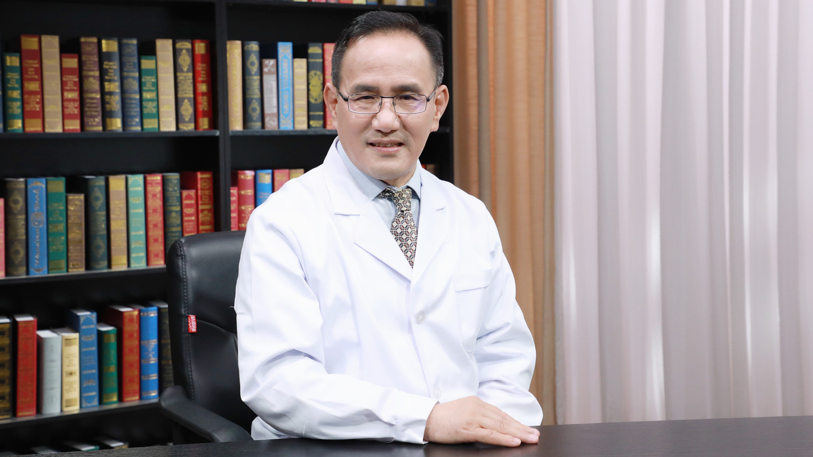

# 儿童肺功能检查

---

## 刘传合 主任医师

首都儿科研究所附属儿童医院变态反应科 哮喘防治中心与肺功能室主任 主任医师 博士生导师；

中华医学会儿科学分会呼吸学组肺功能协作组组长；中华医学会变态反应分会特异性免疫诊断与治疗学组副组长；中华医学会呼吸病学分会肺功能学组委员；中国医师协会变态反应医师分会委员；中国医师协会儿科医师分会儿童过敏学组副组长；《中华儿科杂志》《临床儿科杂志》《中华临床免疫和变态反应杂志》编委。

**主要成就：** 曾在澳大利亚阿德莱德大学妇儿医院进行博士后研究，在美国印第安纳州儿童医院进修儿童肺功能测定技术；承担了教育部留学归国基金、首都发展基金联合攻关项目、卫生部公益性行业科研专项、北京市医管局儿童过敏重点学科建设项目等；参与了GINA、ARIA在我国的推广，儿童防治哮喘指南、肺功能指南等的制定。

**专业特长：** 在儿童哮喘、慢性咳嗽、鼻炎、食物过敏、呼吸系统疾病的诊治方面积累了丰富经验。

---
