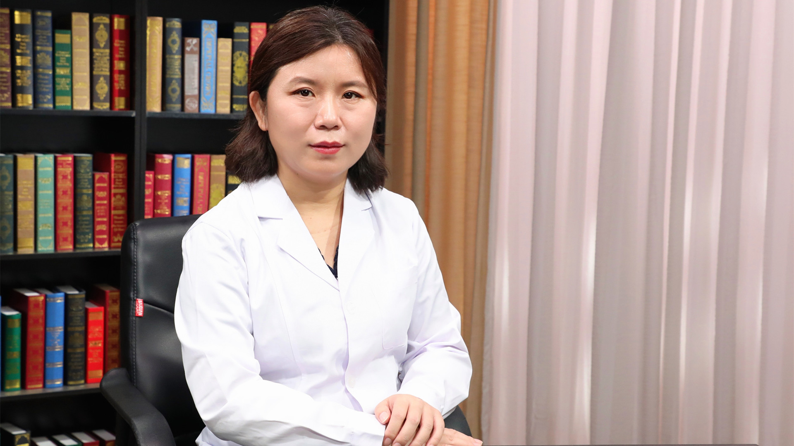

# 4.7 儿童阻塞性睡眠呼吸暂停

---

## 常丽 主任医师

首都儿科研究所附属儿童医院呼吸内科副主任 主任医师 医学博士 硕士生导师；

中华医学会儿科学分会呼吸学组睡眠协作组副组长；中国医师协会儿科医师分会儿童呼吸专业委员会青年委员会副主任委员；中华医学会儿科学分会第十八届委员会呼吸青年学组委员；北京医学会儿科学分会青年委员会委员。

**主要成就：** 以第一作者发表核心期刊论文10余篇；主持并完成市级课题2项；参与编写多本著作，积极参与科普工作。

**专业特长：** 致力于小儿呼吸系统疾病的研究，擅长小儿呼吸道感染性疾病、小儿哮喘、慢性咳嗽、睡眠呼吸障碍等疾病的诊断和治疗。

---
