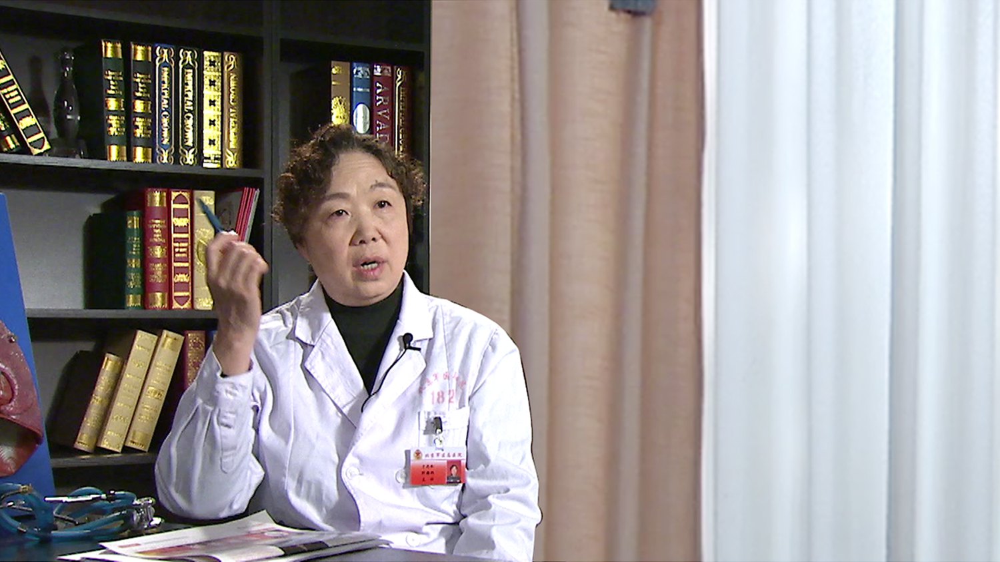

# 肺癌//于忠和教授

---

## 于忠和 主任医师

北京军区总医院肿瘤内科诊治中心主任 主任医师；

中华医学会老年呼吸病学专业委员会委员；中华医学会预防医学会循证预防医学专业委员会委员；中国病理生理缺氧和呼吸专业委员会副主任委员；中国肿瘤微创治疗技术创新战略联盟委员。

**主要成就：** 2004年度享受军队优秀专业技术人才三类岗位津贴；1998、2001年、2004年先后获得3项国家自然科学基金面上项目（均为第一主研人）；2003年获得北京军区医药卫生科研资助项目1项（第一主研人）；先后获得8项军队科技进步奖，其中二等奖四项（其中两项为第一主研人）；发表论文70余篇；先后被北京军区授予“优秀中青年科技干部”和“九五期间科技先进个人”称号；2003年被北京军区联勤部评为“优秀党员”；中国人民解放军总参谋授予“全军优秀博士”称号；2004年被北京军区联勤部授予“弘扬艰苦奋斗，践行三个代表先进个人”，北京军区授予“学习成才、岗位建功先进个人”称号；荣立三等功三次，二等功一次。

**专业特长：** 擅长肺癌、肺炎、支气管肺炎、肺心病、支气管哮喘、胸膜肺间质病等疾病的治疗。

---
